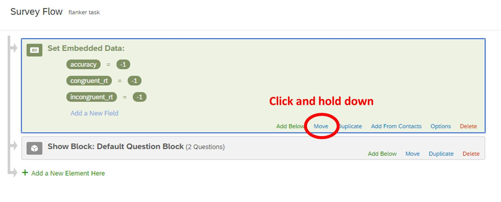
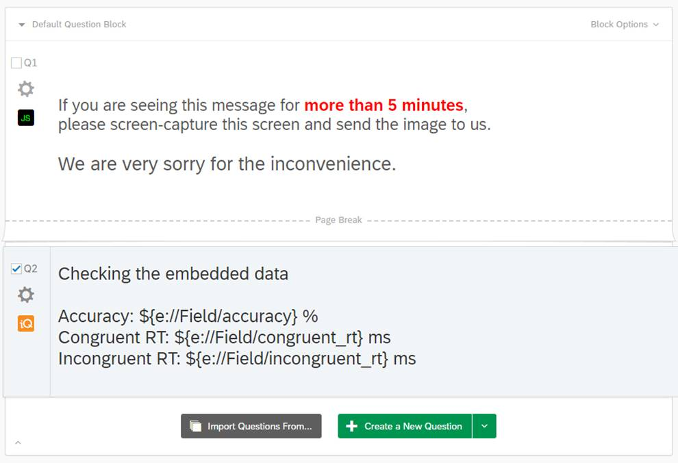

# Embedding the jsPsych Flanker Task into Qualtrics

Let's start from the `demo-flanker.html` in [the jsPsych repository](https://github.com/jspsych/jsPsych/blob/master/examples/demo-flanker.html) and embed it to qualtrics. You can first try the task by clicking [HERE](https://kywch.github.io/jsPsych/examples/demo-flanker.html).

For details of `demo-flanker.html`, please read [the separate tutorial in this GitHub repository](https://github.com/kywch/jsPsych-in-Qualtrics/tree/master/flanker).

---

## The start: `demo-flanker-task.html`

The experiment code, `demo-flanker.html` is included in [the examples folder in the jsPsych repository](https://github.com/jspsych/jsPsych/blob/master/examples/demo-flanker.html). 
Let's make the code work in a separate folder like [the hello-world example](https://www.jspsych.org/tutorials/hello-world/#step-2-create-a-folder-to-store-your-experiment-files).

To do so, you need to change the url of jsPsych scripts, stylesheet, and stimuli of the experiment code. In this tutorial, we will change those twice to make the flanker task (1) run on a new folder and (2) use the GitHub-hosted resources.

First, let's make it run locally. To do so, The jsPsych library, plugins, and stylesheet come from the local folder. As you can see, the `demo-flanker.html` in this repository looks at the local `jspsych-6.1.0` folder for these files.

```html
<script src="jspsych-6.1.0/jspsych.js"></script>
<script src="jspsych-6.1.0/plugins/jspsych-html-keyboard-response.js"></script>
<script src="jspsych-6.1.0/plugins/jspsych-image-keyboard-response.js"></script>
<link rel="stylesheet" href="jspsych-6.1.0/css/jspsych.css"></link>
```

The experiment also needs stimuli images. So, you need to create a folder called `img` in the experiment folder and copy 
[con1.png](https://raw.githubusercontent.com/jspsych/jsPsych/master/examples/img/con1.png), 
[con2.png](https://raw.githubusercontent.com/jspsych/jsPsych/master/examples/img/con2.png),
[inc1.png](https://raw.githubusercontent.com/jspsych/jsPsych/master/examples/img/inc1.png),
and [inc2.png](https://raw.githubusercontent.com/jspsych/jsPsych/master/examples/img/inc2.png) into the `img` folder.

Your folder should look like this (and imagine the html file has the name `demo-flanker.html`).


---

## Using files in public GitHub repositories

To use jsPsych in Qualtrics, the jsPsych javascript and CSS files need to be online and loadable from Qualtrics. 
You can make your files online using GitHub Pages, as explained in the [Hosting jsPsych](github-pages.md) or the [Hosting RT Task](rt-task.md#hosting-this-task-in-github). 

**But you can do so WITHOUT setting up your own GitHub Pages.**

If you see a GitHub file that you want to embed in your experiment, like [jspsych.js in jsPsych GitHub](https://github.com/jspsych/jsPsych/blob/master/jspsych.js),
you can use [jSDelivr](https://www.jsdelivr.com/?docs=gh) to fetch the file like `https://cdn.jsdelivr.net/gh/<github-username>/<repository-name>/<file-name>`: 
<a href="https://cdn.jsdelivr.net/gh/jspsych/jsPsych/jspsych.js">https://cdn.jsdelivr.net/gh/jspsych/jsPsych/jspsych.js</a>.

<font color=red><b>WARNING: If you are developing your experiment and making frequent changes, 
jsDelivr is NOT your best option because it takes up to 24 hours to serve the modified files.</b></font> 
Read [How to use jsDelivr](https://www.freecodecamp.org/news/how-to-use-jsdelivr-e64e5590f66e/) to learn more about jsDelivr and Content Delivery Network (CDN) in general.

### Using this tutorial's GitHub files for the flanker task

This jsPsych-in-Qualtrics repository has the files necessary to run the flanker task. 
These files can be embedded via jSDelivr (github-username: `kywch`, repository-name: `jsPsych-in-Qualtrics`, experiment-folder: `flanker`). 
You need eight files to run the flanker experiment.

* `jspsych.css`: <a href="https://cdn.jsdelivr.net/gh/kywch/jsPsych-in-Qualtrics/flanker/jspsych-6.1.0/css/jspsych.css">https://cdn.jsdelivr.net/gh/kywch/jsPsych-in-Qualtrics/flanker/jspsych-6.1.0/css/jspsych.css</a>
* `jspsych.js`: <a href="https://cdn.jsdelivr.net/gh/kywch/jsPsych-in-Qualtrics/flanker/jspsych-6.1.0/jspsych.js">https://cdn.jsdelivr.net/gh/kywch/jsPsych-in-Qualtrics/flanker/jspsych-6.1.0/jspsych.js</a>
* `jspsych-html-keyboard-response.js`: <a href="https://cdn.jsdelivr.net/gh/kywch/jsPsych-in-Qualtrics/flanker/jspsych-6.1.0/plugins/jspsych-html-keyboard-response.js">https://cdn.jsdelivr.net/gh/kywch/jsPsych-in-Qualtrics/flanker/jspsych-6.1.0/plugins/jspsych-html-keyboard-response.js</a>
* `jspsych-image-keyboard-response.js`: <a href="https://cdn.jsdelivr.net/gh/kywch/jsPsych-in-Qualtrics/flanker/jspsych-6.1.0/plugins/jspsych-image-keyboard-response.js">https://cdn.jsdelivr.net/gh/kywch/jsPsych-in-Qualtrics/flanker/jspsych-6.1.0/plugins/jspsych-image-keyboard-response.js</a>
* `con1.png`: <a href="https://cdn.jsdelivr.net/gh/kywch/jsPsych-in-Qualtrics/flanker/img/con1.png">https://cdn.jsdelivr.net/gh/kywch/jsPsych-in-Qualtrics/flanker/img/con1.png</a>
* `con2.png`: <a href="https://cdn.jsdelivr.net/gh/kywch/jsPsych-in-Qualtrics/flanker/img/con2.png">https://cdn.jsdelivr.net/gh/kywch/jsPsych-in-Qualtrics/flanker/img/con2.png</a>
* `inc1.png`: <a href="https://cdn.jsdelivr.net/gh/kywch/jsPsych-in-Qualtrics/flanker/img/inc1.png">https://cdn.jsdelivr.net/gh/kywch/jsPsych-in-Qualtrics/flanker/img/inc1.png</a>
* `inc2.png`: <a href="https://cdn.jsdelivr.net/gh/kywch/jsPsych-in-Qualtrics/flanker/img/inc2.png">https://cdn.jsdelivr.net/gh/kywch/jsPsych-in-Qualtrics/flanker/img/inc2.png</a>

---

## First transformation: `demo-flanker-transformed.html` and `flanker_main.js`

I prefer to separate out the experiment-related code from the operation-related code, following [the Experiment Factory](https://expfactory.github.io/experiments/) style. 
If you haven't, please visit [the Experiment Factory library](https://expfactory.github.io/experiments/), which contain a ton of experiments with running demos and their code.

In the `demo-flanker.html`, constructing the `timeline` can be considered to be experiment-related, 
and the remaining parts that also appear in [the Hello-World example](hello-world.md), such as loading `jspsych.js` and `jsPsych.init()`, can be considered to be operation-related. 
Here, I am separating the experiment-related code and the operation-related code and putting the code into `flanker_main.js` and `demo-flanker-transformed.html`, respectively, by following steps:

### Step 1. Copy `demo-flanker.html` to `demo-flanker-transformed.html`

### Step 2. Create a new file `flanker_main.js`

And open `flanker_main.js` in a new editor window.

### Step 3. Cut and paste the experiment-related code

Open `demo-flanker-transformed.html`. You should have both `flanker_main.js` and `demo-flanker-transformed.html` opened.

Select the code from the `/* experiment parameters */` line to the `timeline.push(debrief_block);` line, **cut the selection**, and paste it to `flanker_main.js`. **REPEAT**. The code is being **cut-and-pasted** (NOT copy-pasted). 

```js
/* experiment parameters */
var reps_per_trial_type = 4;

/*set up welcome block*/
var welcome = {
  type: "html-keyboard-response",
  stimulus: "Welcome to the experiment. Press any key to begin."
};

/*set up instructions block*/
var instructions = {
  type: "html-keyboard-response",
  stimulus: "<p>In this task, you will see five arrows on the screen, like the example below.</p>" +
    "</img>" +
    "<p>Press the left arrow key if the middle arrow is pointing left. (<)</p>" +
    "<p>Press the right arrow key if the middle arrow is pointing right. (>)</p>" +
    "<p>Press any key to begin.</p>",
  post_trial_gap: 1000
};

/*defining stimuli*/
var test_stimuli = [
  {
    stimulus: "img/con1.png",
    data: { stim_type: 'congruent', direction: 'left'}
  },
  {
    stimulus: "img/con2.png",
    data: { stim_type: 'congruent', direction: 'right'}
  },
  {
    stimulus: "img/inc1.png",
    data: { stim_type: 'incongruent', direction: 'right'}
  },
  {
    stimulus: "img/inc2.png",
    data: { stim_type: 'incongruent', direction: 'left'}
  }
];

/* defining test timeline */
var test = {
  timeline: [{
    type: 'image-keyboard-response',
    choices: [37, 39],
    trial_duration: 1500,
    stimulus: jsPsych.timelineVariable('stimulus'),
    data: jsPsych.timelineVariable('data'),
    on_finish: function (data) {
      var correct = false;
      if (data.direction == 'left' && data.key_press == 37 && data.rt > -1) {
        correct = true;
      } else if (data.direction == 'right' && data.key_press == 39 && data.rt > -1) {
        correct = true;
      }
      data.correct = correct;
    },
    post_trial_gap: function () {
      return Math.floor(Math.random() * 1500) + 500;
    }
  }],
  timeline_variables: test_stimuli,
  sample: {
    type: 'fixed-repetitions',
    size: reps_per_trial_type
  }
};

/*defining debriefing block*/
var debrief = {
  type: "html-keyboard-response",
  stimulus: function () {
    var total_trials = jsPsych.data.get().filter({
      trial_type: 'image-keyboard-response'
    }).count();
    var accuracy = Math.round(jsPsych.data.get().filter({
      correct: true
    }).count() / total_trials * 100);
    var congruent_rt = Math.round(jsPsych.data.get().filter({
      correct: true,
      stim_type: 'congruent'
    }).select('rt').mean());
    var incongruent_rt = Math.round(jsPsych.data.get().filter({
      correct: true,
      stim_type: 'incongruent'
    }).select('rt').mean());
    return "<p>You responded correctly on <strong>" + accuracy + "%</strong> of the trials.</p> " +
      "<p>Your average response time for congruent trials was <strong>" + congruent_rt + "ms</strong>.</p>" +
      "<p>Your average response time for incongruent trials was <strong>" + incongruent_rt + "ms</strong>.</p>" +
      "<p>Press any key to complete the experiment. Thank you!</p>";
  }
};

/*set up experiment structure*/
var timeline = [];
timeline.push(welcome);
timeline.push(instructions);
timeline.push(test);
timeline.push(debrief);
```

### Step 4. `flanker_main.js`: Use the GitHub-hosted stimuli images

Let's use [the above GitHub-hosted images](flanker.md#using-this-tutorials-github-files-for-the-flanker-task). 

The `flanker_main.js` in this tutorial has a few changes to do so. Let's see these changes.

#### Change 1: Adding the image hosting site

The `repo_site` variable was added to locate the JSDELIVR site that hosts stimuli images. You can easily use your repository by changing this line.

```js
// Use JSDELIVR to get the files from a GitHub repository
// https://cdn.jsdelivr.net/gh/<github-username>/<repository-name>/<specific folder or file>
var repo_site = "https://cdn.jsdelivr.net/gh/kywch/jsPsych-in-Qualtrics/flanker/";
```

#### Change 2: Adding `repo_site` in `instructions`

The `repo_site` variable should be added to wherever `img/con1.png`, `img/con2.png`, `img/inc1.png`, and `img/inc2.png` are used like the below. 
The `find` function really helps in doing so.

```js
var instructions = {
  type: "html-keyboard-response",
  stimulus: "<p>In this task, you will see five arrows on the screen, like the example below.</p>" +
    "</img>" +
    "<p>Press the left arrow key if the middle arrow is pointing left. (<)</p>" +
    "<p>Press the right arrow key if the middle arrow is pointing right. (>)</p>" +
    "<p>Press any key to begin.</p>",
  post_trial_gap: 1000
};
```

#### Change 3: Adding `repo_site` in `test_stimuli`

```js
var test_stimuli = [
  {
    stimulus: repo_site + "img/con1.png",
    data: { stim_type: 'congruent', direction: 'left'}
  },
  {
    stimulus: repo_site + "img/con2.png",
    data: { stim_type: 'congruent', direction: 'right'}
  },
  {
    stimulus: repo_site + "img/inc1.png",
    data: { stim_type: 'incongruent', direction: 'right'}
  },
  {
    stimulus: repo_site + "img/inc2.png",
    data: { stim_type: 'incongruent', direction: 'left'}
  }
];
```

### Step 5. `demo-flanker-transformed.html`: Import `flanker_main.js`

Cutting the experiment-related code makes the `demo-flanker-transformed.html` file much shorter. 

Let's also use [the GitHub-hosted JS and CSS files (above)](flanker.md#using-this-tutorials-github-files-for-the-flanker-task). 
In addition, you also need to load `flanker_main.js` by using a `<script>` tag like the other jspsych plugin files (see [the original jsPsych tutorial](https://www.jspsych.org/tutorials/hello-world/#step-6-use-the-jspsych-html-keyboard-response-plugin-to-print-a-message)).

You can use your own repository by creating the jsDelivr link by following [this guide](https://www.jsdelivr.com/?docs=gh).

#### CHANGE 1: Using the GitHub-hosted JS and CSS files

```html
<!-- CHANGE 1: Using the GitHub-hosted files -->
<script src="https://cdn.jsdelivr.net/gh/kywch/jsPsych-in-Qualtrics/flanker/jspsych-6.1.0/jspsych.js"></script>
<script src="https://cdn.jsdelivr.net/gh/kywch/jsPsych-in-Qualtrics/flanker/jspsych-6.1.0/plugins/jspsych-html-keyboard-response.js"></script>
<script src="https://cdn.jsdelivr.net/gh/kywch/jsPsych-in-Qualtrics/flanker/jspsych-6.1.0/plugins/jspsych-image-keyboard-response.js"></script>
<link rel="stylesheet" href="https://cdn.jsdelivr.net/gh/kywch/jsPsych-in-Qualtrics/flanker/jspsych-6.1.0/css/jspsych.css">
```

#### CHANGE 2: Loading the main experiment script in the same local folder

```html
<!-- CHANGE 2: Loading the main experiment script in the same folder-->
<script src="flanker_main.js"></script>
```

### Does this work?

Let's find out by opening `demo-flanker-transformed.html` in a browser. 

### Step 6: Upload `demo-flanker-transformed.html` and `flanker_main.js` to GitHub

If this works, you may want to start a new GitHub repository for this task, as I did with [my simple Reaction Time Task](rt-task.md#hosting-this-task-in-github).

Or, you may just want to try this flanker task in the Qualtrics. In that case, you can use the `flanker_main.js` in this tutorial GitHub repository, 
which is at <a href='https://cdn.jsdelivr.net/gh/kywch/jsPsych-in-Qualtrics/flanker/flanker_main.js'>https://cdn.jsdelivr.net/gh/kywch/jsPsych-in-Qualtrics/flanker/flanker_main.js</a> and available for Qualtrics to load.

---

## Second transformation: `demo-flanker-transformed-with-display-element.html`

Adding the `display_element` parameter in the `jsPsych.init()` and having additional control over the display element is important for embedding jsPsych into Qualtrics. 
The `demo-flanker-transformed-with-display-element.html` file in [this GitHub repository](https://github.com/kywch/jsPsych-in-Qualtrics/blob/master/flanker/demo-simple-rt-task-transformed-with-display-element.html) contains three changes from the `demo-flanker-transformed.html`. 
When you open `demo-flanker-transformed-with-display-element.html` in a browser, you should see the same flanker task. 

Let's look at each change.

### Change 1: Using `display_element` 

By adding the `display_element` parameter in the `jsPsych.init()` like below, jsPsych will render the experiment in the `<div>` called `display_stage`, which the current script does not have yet. So, let's add the `display_stage`.

```js
/* start the experiment */
jsPsych.init({
  timeline: timeline,
  /* Change 1: Using `display_element` */
  display_element: 'display_stage',
  on_finish: function () {
    jsPsych.data.displayData();
  }
});
```

### Change 2: Adding `display_stage` CSS and Div

The `display_stage` needs below CSS and HTML code after the `<body>` tag, which also include the `display_stage_background`. Both are necessary to function well.

```html
<style>
    #display_stage_background {
        width: 100vw;
        background-color: white;
        z-index: -1;
    }

    #display_stage {
        position: fixed;
        left: 1vw;
        top: 1vh;
        height: 98vh;
        width: 98vw;
        background-color: white;
        box-shadow: 1px 1px 1px #999;
        border-radius: 15px;
        z-index: 0;
        overflow-y: hidden;
        overflow-x: hidden;
    }
</style>

<div id='display_stage_background'></div>
<div id='display_stage'></div>
```

### Change 3: Adding extra scripts for Qualtrics

The below scripts are not necessary to run this reaction time experiment, but you need to copy-paste these in Qualtrics later. 

One critical point is that now we use the jsPsych stylesheet hosted in the GitHub Pages 
(explained above in the [Using the jsPsych files](flanker.md#using-this-tutorials-github-files-for-the-flanker-task) section) 
instead of the CSS file in your computer. This is important because Qualtrics can also access the GitHub-hosted files.

```html
<!-- Change 3: Adding extra scripts for Qualtrics -->
<!-- Use JSDELIVR to get the files from a GitHub repository
   https://cdn.jsdelivr.net/gh/<github-username>/<repository-name>/<specific folder or file> -->
<link href="https://cdn.jsdelivr.net/gh/kywch/jsPsych-in-Qualtrics/flanker/jspsych-6.1.0/css/jspsych.css" rel="stylesheet" type="text/css"></link>

<div>
    <span style="font-size: 24px;">
    <br><br>
    If you are seeing this message for <span style="color: rgb(255, 0, 0);"><b>more than 5 minutes</b></span>,<br>
    please screen-capture this screen and send the image to us.
    <br><br>
    <span style="font-size: 28px;">We are very sorry for the inconvenience.</span>
    </span>
</div>
```

---

## Third transformation: `demo-flanker-qualtrics.js`

To make your jsPsych experiment work in Qualtrics, you need to add your code to the below skeleton provided by Qualtrics Question JavaScript Editor. 
For details, see the [Add JavaScript help page](https://www.qualtrics.com/support/survey-platform/survey-module/question-options/add-javascript/).

```js
Qualtrics.SurveyEngine.addOnload(function()
{
	/*Place your JavaScript here to run when the page loads*/

});

Qualtrics.SurveyEngine.addOnReady(function()
{
	/*Place your JavaScript here to run when the page is fully displayed*/

});

Qualtrics.SurveyEngine.addOnUnload(function()
{
	/*Place your JavaScript here to run when the page is unloaded*/

});
```

The `demo-flanker-qualtrics.js` file in [this GitHub repository](https://github.com/kywch/jsPsych-in-Qualtrics/blob/master/rt-task/demo-simple-rt-task-qualtrics.js) contains several changes from `demo-flanker-transformed-with-display-element.html` and can be direclty copy-pasted into the Qualtrics Question JavaScript Editor.

By separating the experiment-related code from the operation-related code, converting the html file to Qualtrics JavaScript function is pretty much similar to [the Hello-World example](hello-world.md#second-transformation-qualtricsjs).

Let's look at each change.

### Change 1: Hiding the Next button

The below javascript code hides the Next button and puts the javascript code in the driving seat.

```js
// Retrieve Qualtrics object and save in qthis
var qthis = this;

// Hide buttons
qthis.hideNextButton();
```

### Change 2: Defining and load required resources

The below javascript defines where the necessary files are so that Qualtrics can load these. If you enabled GitHub Pages of your repository, Qualtrics can load the necessary JS, CSS, and image files right away. Or, you can provide the embeddable links via jsDelivr. Here, let's continue to use jsDelivr.

One way to check whether these files are accessilbe is to view the source of `demo-flanker-transformed.html` and click the imported scripts. For example of `jspsych.js`, <a href='https://cdn.jsdelivr.net/gh/kywch/jsPsych-in-Qualtrics/flanker/jspsych-6.1.0/jspsych.js'>https://cdn.jsdelivr.net/gh/kywch/jsPsych-in-Qualtrics/flanker/jspsych-6.1.0/jspsych.js</a>.

```js
// https://cdn.jsdelivr.net/gh/<github-username>/<repository-name>/<experiment-folder>
var task_github = "https://cdn.jsdelivr.net/gh/kywch/jsPsych-in-Qualtrics/flanker/"; 

// requiredResources must include all the JS files that demo-simple-rt-task-transformed.html uses.
var requiredResources = [
    task_github + "jspsych-6.1.0/jspsych.js",
    task_github + "jspsych-6.1.0/plugins/jspsych-html-keyboard-response.js",
    task_github + "jspsych-6.1.0/plugins/jspsych-image-keyboard-response.js",
    task_github + "flanker_main.js"
];

function loadScript(idx) {
    console.log("Loading ", requiredResources[idx]);
    jQuery.getScript(requiredResources[idx], function () {
        if ((idx + 1) < requiredResources.length) {
            loadScript(idx + 1);
        } else {
            initExp();
        }
    });
}

if (window.Qualtrics && (!window.frameElement || window.frameElement.id !== "mobile-preview-view")) {
    loadScript(0);
}
```

### Change 3: Appending the display_stage Div using jQuery

In Qualtrics, jQuery (loaded by default) is used to append the `display_stage_background` and `display_stage` Divs. The CSS for these elements will be added directly to Question HTML later in this tutorial.

```js
// jQuery is loaded in Qualtrics by default
jQuery("<div id = 'display_stage_background'></div>").appendTo('body');
jQuery("<div id = 'display_stage'></div>").appendTo('body');
```

### Change 4: Wrapping jsPsych.init() in a function

The main experiment codes are wrapped in the `initExp` function to make sure it runs after all the necessary library and plugin files are loaded (as defined in the `loadScript` function above).

### Change 5: Summarizing and save the results to Qualtrics

[The jsPsych tutorial](https://www.jspsych.org/tutorials/rt-task/#part-11-data-aggregation) shows you how you can process and summarize the experiment results online. **Wouldn't it be great if your experiment results are directly included in your Qualtrics data?** 

Well, you can actually summarize the results online and save those results in [Qualtrics' Embedded Data](https://www.qualtrics.com/support/survey-platform/survey-module/survey-flow/standard-elements/embedded-data/) using the [setEmbeddedData](https://s.qualtrics.com/WRAPI/QuestionAPI/classes/Qualtrics%20JavaScript%20Question%20API.html#method_setEmbeddedData) function.

`demo-flanker-qualtrics.js` does so when the jsPsych experiment finishes by running the below code from [`debrief_block`](https://github.com/kywch/jsPsych-in-Qualtrics/tree/master/flanker#part-5-presenting-feedback-to-the-participants).

```js
jsPsych.init({
    timeline: timeline,
    display_element: 'display_stage',
    on_finish: function (data) {
        /* Change 5: Summarizing and save the results to Qualtrics */
        // summarize the results
        var total_trials = jsPsych.data.get().filter({
            trial_type: 'image-keyboard-response'
        }).count();
        var accuracy = Math.round(jsPsych.data.get().filter({
            correct: true
        }).count() / total_trials * 100);
        var congruent_rt = Math.round(jsPsych.data.get().filter({
            correct: true,
            stim_type: 'congruent'
        }).select('rt').mean());
        var incongruent_rt = Math.round(jsPsych.data.get().filter({
            correct: true,
            stim_type: 'incongruent'
        }).select('rt').mean());

        // save to qualtrics embedded data
        Qualtrics.SurveyEngine.setEmbeddedData("accuracy", accuracy);
        Qualtrics.SurveyEngine.setEmbeddedData("congruent_rt", congruent_rt);
        Qualtrics.SurveyEngine.setEmbeddedData("incongruent_rt", incongruent_rt);

        /* Change 6: Adding the clean up and continue functions.*/
        // clear the stage
        jQuery('display_stage').remove();
        jQuery('display_stage_background').remove();

        // simulate click on Qualtrics "next" button, making use of the Qualtrics JS API
        qthis.clickNextButton();
    }
});
```

### Change 6: Adding the clean up and continue functions

When the jsPsych ends, `display_stage` and `display_stage_background` should be removed. Then, execulte the `clickNextButton` to simulate clicking the Next button and proceed to the next question.

---

## Finally, embedding jsPsych in Qualtrics

Let's log in to Qualtrics and take a look at each step.

### Step 1. Create a new Qualtrics project and then a new question

This tutorial assumes that readers are much more familiar with Qualtrics. For Qualtrics tutorial, there are other excellent tutorials available like [this Qualtrics User Guide](https://www.unthsc.edu/center-for-innovative-learning/qualtrics-user-guide/).

To continue, please create a new Qualtrics project. Then, create a new question and (1) change its format to **Text/Graphic**.


### Step 2. Open the Question JavaScript editor and copy paste the whole `demo-simple-rt-task-qualtrics.js`

Keep going in the above picture. (2) Click the gear to open the dropdown menu, and then (3) find and click **Add JavaScript**.


### Step 3. Open the Question HTML editor and copy paste the portion of `demo-flanker-transformed-with-display-element.html`

The Change 3 section of the `demo-flanker-transformed-with-display-element.html` file contains the link to jsPsych CSS file, the inline styles for `display_stage` Div, and the error message to be displayed when things go wrong.

To open the HTML editor, click the `HTML View` button. 


Then, copy paste the portion of `demo-flanker-transformed-with-display-element.html` to the HTML editor, starting from `<!-- COPY PASTE TO QUALTRICS FROM HERE -->` to `<!-- COPY PASTE TO QUALTRICS UP TO HERE -->`. 

```html
<!-- Change 3: Adding extra scripts for Qualtrics -->
<!-- COPY PASTE TO QUALTRICS FROM HERE -->
<link href="https://cdn.jsdelivr.net/gh/kywch/jsPsych-in-Qualtrics/flanker/jspsych-6.1.0/css/jspsych.css" rel="stylesheet" type="text/css"></link>

<div>
<span style="font-size: 24px;">
    <br><br>
    If you are seeing this message for <span style="color: rgb(255, 0, 0);"><b>more than 5
        minutes</b></span>,<br>
    please screen-capture this screen and send the image to us.
    <br><br>
    <span style="font-size: 28px;">We are very sorry for the inconvenience.</span>
</span>
</div>

<!-- Change 2: Adding `display_stage` CSS and Div -->
<style>
#display_stage_background {
    width: 100vw;
    background-color: white;
    z-index: -1;
}

#display_stage {
    position: fixed;
    left: 1vw;
    top: 1vh;
    height: 98vh;
    width: 98vw;
    background-color: white;
    box-shadow: 1px 1px 1px #999;
    border-radius: 15px;
    z-index: 0;
    overflow-y: hidden;
    overflow-x: hidden;
}
</style>
<!-- COPY PASTE TO QUALTRICS UP TO HERE -->
```

After copy pasting, you should see something like below.


### Step 4. Creating Embedded Data elements

To store the experiment results -- **accuracy**, **congruent_rt**, and **incongruent_rt** -- in Qualtrics, you need to create the Embedded Data elements named **accuracy**, **congruent_rt**, and **incongruent_rt** in your survey by following [this Qualtrics tutorial](https://www.qualtrics.com/support/survey-platform/survey-module/survey-flow/standard-elements/embedded-data/#CreatingAnEmbeddedDataElement).

1. Click **Survey Flow** from the Survey tab
2. Click **Add a New Element Here**
3. Choose **Embedded Data** 
4. Click **Create New Field or Choose From Dropdown** and type **accuracy**
5. Click **Set a Value Now** and type -1
6. Click **Add a New Field** and type **congruent_rt**
7. Click **Set a Value Now** and type -1
8. Click **Add a New Field** and type **incogruent_rt**
9. Click **Set a Value Now** and type -1

### Step 5. Move `Set Embedded Data` block to the top of Survey Flow

The `accuracy`, `congruent_rt`, and `incongruent_rt` fields should be defined before the jsPsych reaction time task, 
so you need to move the Embedded Data block to the **top** of the Survey Flow.

Click and hold down **Move** to drag the Embedded Data to the top of the Survey Flow. After this, you should see the Survey Flow like below.



### Step 6. Add a check for the Embedded Data

You should make sure that the experiment results are saved correctly. 
You can do so by showing the `accuracy`, `congruent_rt`, and `incongruent_rt` Embedded Data after the reaction task.

1. Click **Add Page Break**
2. Click **Create a New Question**
3. Change Question Type to **Text/Graphic**
4. Type `${e://Field/accuracy}`, `${e://Field/congruent_rt}`, and `${e://Field/incongruent_rt}` to access these Embedded Data



### Step 7. Publish and test!

Publish the survey by following [this Qualtrics tutorial](https://www.qualtrics.com/support/survey-platform/survey-module/survey-publishing-versions/#PublishingNew). Then, an anonymous Qualtrics link is generated. If you click this link, you should be able to see the same reaction time task running in Qualtrics. For example, try [this Qualtrics link](https://ssd.az1.qualtrics.com/jfe/form/SV_enXPx66m9iOM6Sp).

---

## Do you also want to save the trial-by-trial data?

I describe two ways for saving the experiment files in these tutorials. 

1. [Saving data to a web server using PHP](save-php.md)
2. [Saving data to your Dropbox folder](save-dropbox.md)

