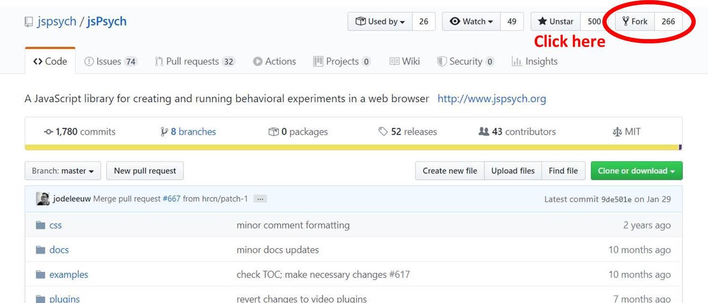
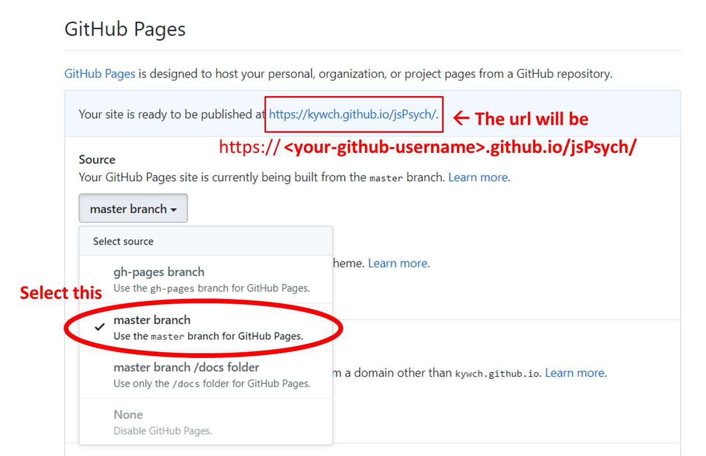

# Making jsPsych files loadable in Qualtrics

To use jsPsych in Qualtrics, the jsPsych javascript and CSS files need to be online and loadable from Qualtrics. [GitHub Pages](https://pages.github.com/) allows you to do so with only three steps (if you have a GitHub account).

I will use these GitHub-hosted scripts in the following tutorials, so please complete this step.

---

## Step 0. Create a GitHub account

Go to [the GitHub site](https://github.com/join) and create your account.

---

## Step 1. Fork the jsPsych repository

Go to [the jsPsych repository](https://github.com/jspsych/jsPsych) and click the `Fork` button to copy the repo to your account.

---

## Step 2. Click the Settings button

The whole jsPsych repository has been copied to your account, which should be accessible at `https://github.com/<your-github-username>/jsPsych/`. For example, <a href='https://github.com/kywch/jsPsych/'>https://github.com/kywch/jsPsych/</a>.

Go to your copy of the jsPsych repository and click the **Settings** button on the home page.

---

## Step 3. Enable GitHub Pages for the jsPsych repository

Scroll down and find the **GitHub Pages** section. Select the **Source** to be the **master branch**.

Within a few minutes, a website will be available at `https://<your-github-username>.github.io/jsPsych/`. For example, <a href='https://kywch.github.io/jsPsych/'>https://kywch.github.io/jsPsych/</a>.

---

## And, you are done.

You can check with your browser by directly going to the **jspsych.js**, **jspsych.css**, and **jspsych-html-keyboard-response.js**.

- **jspsych.js** should be available at `https://<your-github-username>.github.io/jsPsych/jspsych.js`, like <a href='https://kywch.github.io/jsPsych/jspsych.js'>https://kywch.github.io/jsPsych/jspsych.js</a>.
- **jspsych.css** should be available at `https://<your-github-username>.github.io/jsPsych/css/jspsych.css`, like <a href='https://kywch.github.io/jsPsych/css/jspsych.css'>https://kywch.github.io/jsPsych/css/jspsych.css</a>.
- **jspsych-html-keyboard-response.js** should be available at `https://<your-github-username>.github.io/jsPsych/plugins/jspsych-html-keyboard-response.js`, like <a href='https://kywch.github.io/jsPsych/plugins/jspsych-html-keyboard-response.js'>https://kywch.github.io/jsPsych/plugins/jspsych-html-keyboard-response.js</a>.

---

## BUT WAIT! This is not the only way.

There are two more ways to make your files loadable in Qualtrics.

* Creating your experiment GitHub repostory **(preferred)**, like the [Reaction-Time Task](rt-task.md#hosting-this-task-in-github) tutorial.
* Borrowing files from public GitHub repository, like the [Flanker Task](flanker.md#using-files-in-public-github-repositories) tutorial