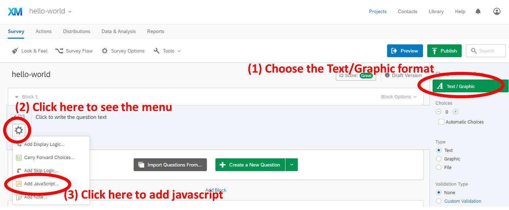
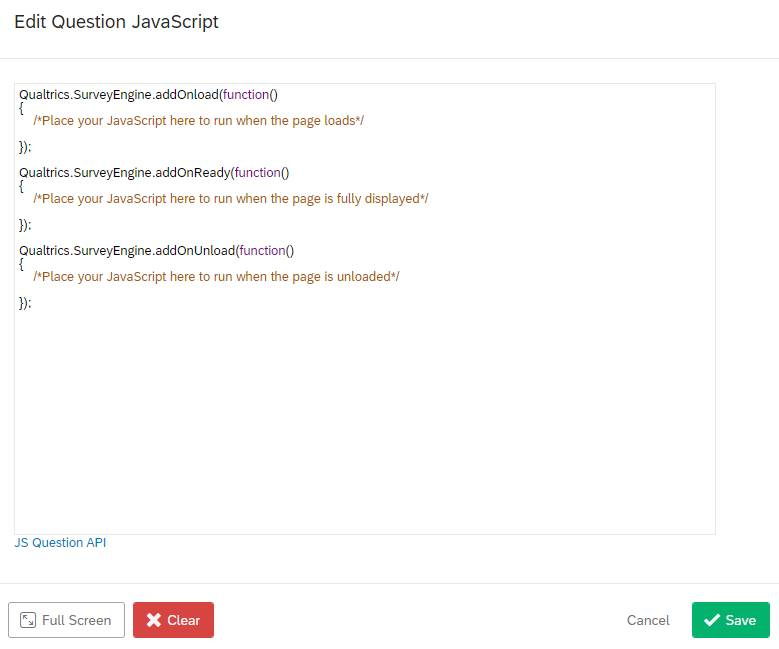
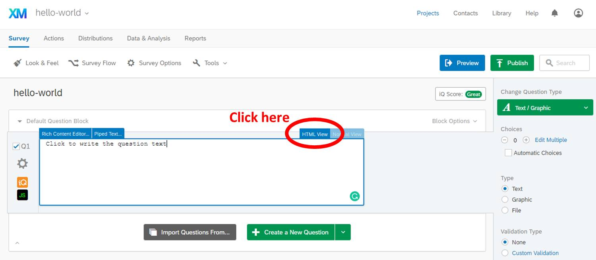
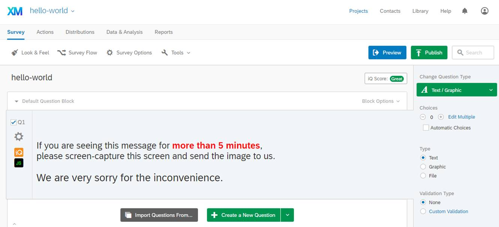

# Embedding the jsPsych "Hello world" experiment into Qualtrics

Let's start from [the original jsPsych "Hello world!" example](https://www.jspsych.org/tutorials/hello-world/) and embed it to qualtrics. To do so, you need to use the `display_element` option, which was briefly mentioned in [the jsPsych tutorial](https://www.jspsych.org/overview/experiment-options/#controlling-where-jspsych-renders-on-the-page). 

---

## The start: `experiment.html`

After completing [the original jsPsych "Hello world!" example](https://www.jspsych.org/tutorials/hello-world/), your folder should look like this.


When you open `experiment.html` using your programming-friendly text editor, such as [Atom](https://atom.io) or [VSCode](https://code.visualstudio.com/), you should see the html code like below.

```html
<!DOCTYPE html>
<html>
	<head>
		<title>My experiment</title>
		<script src="jspsych-6.0.5/jspsych.js"></script>
		<script src="jspsych-6.0.5/plugins/jspsych-html-keyboard-response.js"></script>
		<link href="jspsych-6.0.5/css/jspsych.css" rel="stylesheet" type="text/css"></link>
	</head>
	<body></body>
	<script>

	var hello_trial = {
		type: 'html-keyboard-response',
		stimulus: 'Hello world!'
	}

	jsPsych.init({
		timeline: [hello_trial]
	})

	</script>
</html>
```

When you open `experiment.html` in a browser, you should see "Hello world!" printed on the screen, and if you press a key on the keyboard, the text should disappear (ending the trial).

---

## First transformation: `experiment-with-display-element.html`

Adding the `display_element` parameter in the `jsPsych.init()` and having additional control over the display element is important for embedding jsPsych into Qualtrics. The `experiment-with-display-element.html` file in [this GitHub repository](https://github.com/kywch/jsPsych-in-Qualtrics/blob/master/hello-world/experiment-with-display-element.html) contains three changes from the `experiment.html`. When you open `experiment-with-display-element.html` in a browser, you should see the same "Hello world!". 

Let's look at each change.

### Change 1: Using `display_element` 

By adding the `display_element` parameter in the `jsPsych.init()` like below, jsPsych will render the experiment in the '<div>' called `display_stage`, which the current script does not have yet. So, let's add the `display_stage`.

```html
jsPsych.init({
    timeline: [hello_trial],
    display_element: 'display_stage'
})
```

### Change 2: Adding `display_stage` CSS and Div

The `display_stage` needs below CSS and HTML code after the `<body>` tag, which also include the `display_stage_background`. Both are necessary to function well.

```html
<style>
    #display_stage_background {
        width: 100vw;
        background-color: white;
        z-index: -1;
    }

    #display_stage {
        position: fixed;
        left: 1vw;
        top: 1vh;
        height: 98vh;
        width: 98vw;
        background-color: white;
        box-shadow: 1px 1px 1px #999;
        border-radius: 15px;
        z-index: 0;
        overflow-y: hidden;
        overflow-x: hidden;
    }
</style>

<div id='display_stage_background'></div>
<div id='display_stage'></div>
```

### Change 3: Adding extra scripts for Qualtrics

The below scripts are not necessary to run this hello-world experiment, but you need to copy-paste these in Qualtrics later. 

One critical point is that now we use the jsPsych stylesheet hosted in the GitHub Pages (explained in the [Hosting jsPsych](github-pages.md) section) instead of the CSS file in your computer. This is important because Qualtrics can also access the GitHub-hosted files.

```html
<!-- Change 3: Adding extra scripts for Qualtrics -->
<!-- COPY PASTE TO QUALTRICS FROM HERE -->
<link href="https://kywch.github.io/jsPsych/css/jspsych.css" rel="stylesheet" type="text/css"></link>
<div>
    <span style="font-size: 24px;">
        <br><br>
        If you are seeing this message for <span style="color: rgb(255, 0, 0);"><b>more than 5 minutes</b></span>,<br>
        please screen-capture this screen and send the image to us.
        <br><br>
        <span style="font-size: 28px;">We are very sorry for the inconvenience.</span>
    </span>
</div>
```

### Putting it all together

So the `experiment-with-display-element.html` code looks like this.

```html
<!DOCTYPE html>
<html>

<head>
    <title>My experiment</title>
    <script src="jspsych-6.1.0/jspsych.js"></script>
    <script src="jspsych-6.1.0/plugins/jspsych-html-keyboard-response.js"></script>
    <link href="jspsych-6.1.0/css/jspsych.css" rel="stylesheet" type="text/css"></link>
</head>

<body>

    <!-- Change 3: Adding extra scripts for Qualtrics -->
    <!-- COPY PASTE TO QUALTRICS FROM HERE -->
    <link href="https://kywch.github.io/jsPsych/css/jspsych.css" rel="stylesheet" type="text/css"></link>
    <div>
        <span style="font-size: 24px;">
            <br><br>
            If you are seeing this message for <span style="color: rgb(255, 0, 0);"><b>more than 5 minutes</b></span>,<br>
            please screen-capture this screen and send the image to us.
            <br><br>
            <span style="font-size: 28px;">We are very sorry for the inconvenience.</span>
        </span>
    </div>

    <!-- Change 2: Adding `display_stage` CSS and Div -->
    <style>
        #display_stage_background {
            width: 100vw;
            background-color: white;
            z-index: -1;
        }

        #display_stage {
            position: fixed;
            left: 1vw;
            top: 1vh;
            height: 98vh;
            width: 98vw;
            background-color: white;
            box-shadow: 1px 1px 1px #999;
            border-radius: 15px;
            z-index: 0;
            overflow-y: hidden;
            overflow-x: hidden;
        }
    </style>
    <!-- COPY PASTE UP TO QUALTRICS TO HERE -->

    <div id='display_stage_background'></div>
    <div id='display_stage'></div>
    
</body>

<script>
    var hello_trial = {
        type: 'html-keyboard-response',
        stimulus: 'Hello world!'
    }

    /* Change 1: Using `display_element` */
    jsPsych.init({
        timeline: [hello_trial],
        display_element: 'display_stage'
    })
</script>

</html>
```

---

## Second transformation: `qualtrics.js`

To make your jsPsych experiment work in Qualtrics, you need to add your code to the below skeleton provided by Qualtrics Question JavaScript Editor. For details, see the [Add JavaScript help page](https://www.qualtrics.com/support/survey-platform/survey-module/question-options/add-javascript/).

```js
Qualtrics.SurveyEngine.addOnload(function()
{
	/*Place your JavaScript here to run when the page loads*/

});

Qualtrics.SurveyEngine.addOnReady(function()
{
	/*Place your JavaScript here to run when the page is fully displayed*/

});

Qualtrics.SurveyEngine.addOnUnload(function()
{
	/*Place your JavaScript here to run when the page is unloaded*/

});
```

The `qualtrics.js` file in [this GitHub repository](https://github.com/kywch/jsPsych-in-Qualtrics/blob/master/hello-world/qualtrics.js) contains several changes from `experiment-with-display-element.html` and can be put into Qualtrics.

Let's look at each change.

### Change 1: Hide the Next button

The below javascript code hides the Next button and puts the javascript code in the driving seat.

```js
// Retrieve Qualtrics object and save in qthis
var qthis = this;

// Hide buttons
qthis.hideNextButton();
```

### Change 2: Define and load required resources

The below javascript defines where the necessary files are so that Qualtrics can load these.

After [Making jsPsych files loadable in Qualtrics](github-pages.md), you should be able to put your github page url at `jslib_url`.

```js
var jslib_url = "https://kywch.github.io/jsPsych/"; // "https://<your-github-username>.github.io/jsPsych/"

// the below urls must be accessible with your browser
// for example, https://kywch.github.io/jsPsych/jspsych.js
var requiredResources = [
    jslib_url + "jspsych.js",
    jslib_url + "plugins/jspsych-html-keyboard-response.js"
];

function loadScript(idx) {
    console.log("Loading ", requiredResources[idx]);
    jQuery.getScript(requiredResources[idx], function () {
        if ((idx + 1) < requiredResources.length) {
            loadScript(idx + 1);
        } else {
            initExp();
        }
    });
}

if (window.Qualtrics && (!window.frameElement || window.frameElement.id !== "mobile-preview-view")) {
    loadScript(0);
}
```

### Change 3: Append the display_stage Div using jQuery

In Qualtrics, jQuery (loaded by default) is used to append the `display_stage_background` and `display_stage` Divs. The CSS for these elements will be added directly to Question HTML later in this tutorial.

```js
// jQuery is loaded in Qualtrics by default
jQuery("<div id = 'display_stage_background'></div>").appendTo('body');
jQuery("<div id = 'display_stage'></div>").appendTo('body');
```

### Change 4: Wrap jsPsych.init() in a function

The main experiment codes are wrapped in the `initExp` function to make sure it runs after all the necessary library and plugin files are loaded (as defined in the `loadScript` function above).

```js
function initExp() {

    var hello_trial = {
        type: 'html-keyboard-response',
        stimulus: 'Hello world!'
    }

    jsPsych.init({
        timeline: [hello_trial],
        display_element: 'display_stage',
    });
}
```

### Change 5: Add the clean up and continue functions

When the jsPsych ends, `display_stage` and `display_stage_background` should be removed. Then, execulte the `clickNextButton` to simulate clicking the Next button and proceed to the next question.

```js
on_finish: function (data) {
    // clear the stage
    jQuery('display_stage').remove();
    jQuery('display_stage_background').remove();

    // simulate click on Qualtrics "next" button, making use of the Qualtrics JS API
    qthis.clickNextButton();
}
```

### Putting it all together

So the `qualtrics.js` code looks like this.

```js
Qualtrics.SurveyEngine.addOnload(function () {

    /*Place your JavaScript here to run when the page loads*/

    /* Change 2: Hide the Next button */
    // Retrieve Qualtrics object and save in qthis
    var qthis = this;

    // Hide buttons
    qthis.hideNextButton();

    /* Change 3: Define and load required resources */
    var jslib_url = "https://kywch.github.io/jsPsych/";

    // the below urls must be accessible with your browser
    // for example, https://kywch.github.io/jsPsych/jspsych.js
    var requiredResources = [
        jslib_url + "jspsych.js",
        jslib_url + "plugins/jspsych-html-keyboard-response.js"
    ];

    function loadScript(idx) {
        console.log("Loading ", requiredResources[idx]);
        jQuery.getScript(requiredResources[idx], function () {
            if ((idx + 1) < requiredResources.length) {
                loadScript(idx + 1);
            } else {
                initExp();
            }
        });
    }

    if (window.Qualtrics && (!window.frameElement || window.frameElement.id !== "mobile-preview-view")) {
        loadScript(0);
    }

    /* Change 4: Append the display_stage Div using jQuery */
    // jQuery is loaded in Qualtrics by default
    jQuery("<div id = 'display_stage_background'></div>").appendTo('body');
    jQuery("<div id = 'display_stage'></div>").appendTo('body');


    /* Change 5: Wrap jsPsych.init() in a function */
    function initExp() {

        var hello_trial = {
            type: 'html-keyboard-response',
            stimulus: 'Hello world!'
        }

        jsPsych.init({
            timeline: [hello_trial],
            display_element: 'display_stage',

            /* Change 6: Add the clean up and continue functions.*/
            on_finish: function (data) {
                // clear the stage
                jQuery('display_stage').remove();
                jQuery('display_stage_background').remove();

                // simulate click on Qualtrics "next" button, making use of the Qualtrics JS API
                qthis.clickNextButton();
            }
        });
    }
});

Qualtrics.SurveyEngine.addOnReady(function () {
    /*Place your JavaScript here to run when the page is fully displayed*/

});

Qualtrics.SurveyEngine.addOnUnload(function () {
    /*Place your JavaScript here to run when the page is unloaded*/

});
```

---

## Finally, embedding jsPsych in Qualtrics

Let's log in to Qualtrics and take a look at each step.

### Step 1. Create a new Qualtrics project and then a new question

This tutorial assumes that readers are much more familiar with Qualtrics. For Qualtrics tutorial, there are other excellent tutorials available like [this Qualtrics User Guide](https://www.unthsc.edu/center-for-innovative-learning/qualtrics-user-guide/).

To continue, please create a new Qualtrics project. Then, create a new question and (1) change its format to **Text/Graphic**.



### Step 2. Open the Question JavaScript editor and copy paste the whole `qualtrics.js`

Keep going in the above picture. (2) Click the gear to open the dropdown menu, and then (3) find and click **Add JavaScript**.



### Step 3. Open the Question HTML editor and copy paste the portion of `experiment-with-display-element.html`

The Change 3 section of the `experiment-with-display-element.html` file contains the link to jsPsych CSS file, the inline styles for `display_stage` Div, and the error message to be displayed when things go wrong.

To open the HTML editor, click the `HTML View` button. 



Then, copy paste the portion of `experiment-with-display-element.html` to the HTML editor, starting from `<!-- COPY PASTE TO QUALTRICS FROM HERE -->` to `<!-- COPY PASTE TO QUALTRICS UP TO HERE -->`. After copy pasting, you should see something like below.



### Step 4. Publish and test!

Publish the survey by following [this Qualtrics tutorial](https://www.qualtrics.com/support/survey-platform/survey-module/survey-publishing-versions/#PublishingNew). Then, an anonymous Qualtrics link is generated. If you click this link, you should be able to see "Hello World!" in Qualtrics. For example, here is [a just another Hello-World Qualtrics survey](https://ssd.az1.qualtrics.com/jfe/form/SV_ehvC3v9MYG83YMJ).