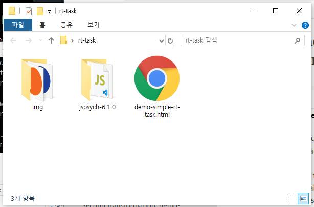
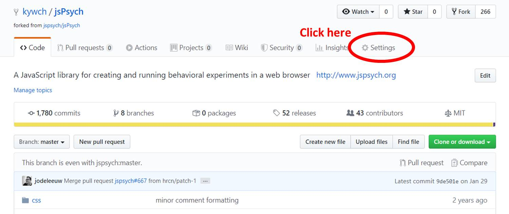
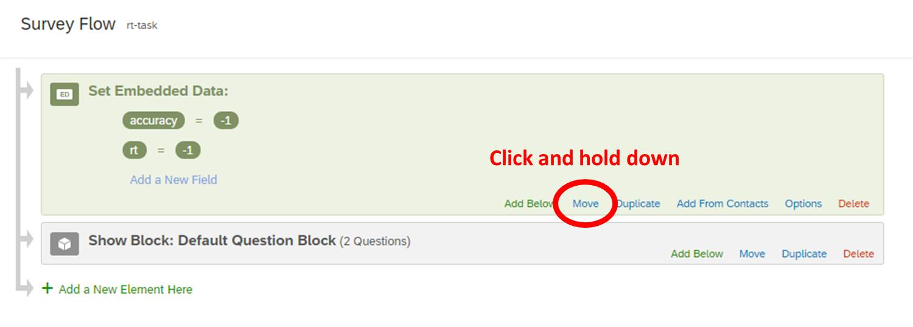

# Embedding the jsPsych Simple Reaction Time Task into Qualtrics

<font color=red>**WARNING!! This tutorial series is based on version `6.x` of jsPsych. Due to extensive changes in jsPsych 7.x and above, many things in this tutorial may not work with jsPsych v7.x and above. You can get [jsPsych v6.3.1 (the last jsPsych 6.x release) from here](https://github.com/jspsych/jsPsych/releases/download/v6.3.1/jspsych-6.3.1.zip). Here, I used `v6.1.0`, which is not much different from `v6.3.1`**</font>

Let's try to embed a more complicated task, [the original jsPsych v6.3 Simple Reaction Time Task](https://www.jspsych.org/6.3/tutorials/rt-task/), to qualtrics. You can first try the task by clicking [HERE](https://kywch.github.io/Simple-RT-Task/demo-simple-rt-task.html).

---

## The start: `demo-simple-rt-task.html`

The original experiment code, `demo-simple-rt-task.html` is [here](https://github.com/kywch/Simple-RT-Task/blob/master/demo-simple-rt-task.html). Let's make the code work in a separate folder like [the hello-world example](https://www.jspsych.org/tutorials/hello-world/#step-2-create-a-folder-to-store-your-experiment-files).

To do so, you need to change the url of jsPsych scripts, stylesheet, and stimuli of the experiment code. In this tutorial, we will change those twice to make the rt-task (1) run on a new folder and (2) use the GitHub-hosted resources.

First, let's make it run locally. To do so, The jsPsych library, plugins, and stylesheet come from the local folder. As you can see, the `demo-simple-rt-task.html` in this repository looks at the local `jspsych-6.1.0` folder for these files.

```html
<script src="jspsych-6.1.0/jspsych.js"></script>
<script src="jspsych-6.1.0/plugins/jspsych-html-keyboard-response.js"></script>
<script src="jspsych-6.1.0/plugins/jspsych-image-keyboard-response.js"></script>
<link rel="stylesheet" href="jspsych-6.1.0/css/jspsych.css"></link>
```

The experiment also needs stimuli images (see [the original jsPsych v6.3 tutorial](https://www.jspsych.org/6.3/tutorials/rt-task/#part-3-show-instructions)). So, you need to create a folder called `img` in the experiment folder and copy [blue.png](https://www.jspsych.org/img/blue.png) and [orange.png](https://www.jspsych.org/img/orange.png) into the `img` folder.

Your folder should look like this.



---

## Hosting this task in GitHub

To use jsPsych in Qualtrics, the jsPsych javascript and CSS files need to be online and loadable from Qualtrics. Creating a GitHub repository for your experiment helps you do so in simple steps.

### Step 0. Create a GitHub account

Go to [the GitHub site](https://github.com/join) and create your account.

### Step 1. Create a new GitHub repository

First, create a repository for your experiment by following [this `Create a repo` guide](https://help.github.com/en/github/getting-started-with-github/create-a-repo).

### Step 2. Add experiment files to the repository

Upload your experiment files to the repository. The easy way is to drag and drop your files like this [`Adding a file to a repository`guide](https://help.github.com/en/github/managing-files-in-a-repository/adding-a-file-to-a-repository). Do NOT forget to click the `Commit changes` button.

My Simple-RT-Task repository looks like this: <a href='https://github.com/kywch/Simple-RT-Task'>https://github.com/kywch/Simple-RT-Task/</a>.

### Step 3. Click the Settings button

Click the **Settings** button on the repository home page.



### Step 4. Enable GitHub Pages for your experiment

Scroll down and find the **GitHub Pages** section. Select the **Source** to be the **master branch**.


Within a few minutes, a website will be available at `https://<your-github-username>.github.io/<your-experiment-name>/`. 

How do you know the page is up and running? Well, let's try to access the `jspsych.css` file by going into `https://<your-github-username>.github.io/<your-experiment-name>/jspsych-6.1.0/css/jspsych.css`. For example, <a href='https://kywch.github.io/Simple-RT-Task/jspsych-6.1.0/css/jspsych.css'>https://kywch.github.io/Simple-RT-Task/jspsych-6.1.0/css/jspsych.css</a>.

### WAIT, did you know?

Did you know that you also accidentally made your task online that anyone with the Internet can try your task?

Open your browser and go to `https://<your-github-username>.github.io/<your-experiment-name>/demo-simple-rt-task.html`, or try mine: <a href='https://kywch.github.io/Simple-RT-Task/demo-simple-rt-task.html'>https://kywch.github.io/Simple-RT-Task/demo-simple-rt-task.html</a>.

If your expeirment doesnt' work, (this may sound silly but worked for me) try to turn off and on the GitHub Pages multiple times (i.e., switching the `Source` to be `None` and `master branch`).

---

## First transformation: `demo-simple-rt-task-transformed.html` and `rt-task_main.js`

I prefer to separate out the experiment-related code from the operation-related code, following [the Experiment Factory](https://expfactory.github.io/experiments/) style. If you haven't, please visit [the Experiment Factory library](https://expfactory.github.io/experiments/), which contain a ton of experiments with running demos and their code.

In the `demo-simple-rt-task.html`, constructing the `timeline` can be considered to be experiment-related, and the remaining parts that also appear in [the Hello-World example](hello-world.md), such as loading `jspsych.js` and `jsPsych.init()` can be considered to be operation-related. Here, I am separating the experiment-related code and the operation-related code and putting the code into `rt-task_main.js` and `demo-simple-rt-task-transformed.html`, respectively, by following steps:

### Step 1. Copy `demo-simple-rt-task.html` to `demo-simple-rt-task-transformed.html`

### Step 2. Create a new file `rt-task_main.js`

And open `rt-task_main.js` in a new editor window.

### Step 3. Cut and paste the experiment-related code

Open `demo-simple-rt-task-transformed.html`. You should have both `rt-task_main.js` and `demo-simple-rt-task-transformed.html` opened.

Select the code from the `/* create timeline */` line to the `timeline.push(debrief_block);` line, **cut the selection**, and paste it to `rt-task_main.js`. **REPEAT**. The code is being **cut-and-pasted** (NOT copy-pasted). 

```js
/* create timeline */
var timeline = [];

/* define welcome message trial */
var welcome_block = {
    type: "html-keyboard-response",
    stimulus: "Welcome to the experiment. Press any key to begin."
};
timeline.push(welcome_block);

/* define instructions trial */
var instructions = {
    type: "html-keyboard-response",
    stimulus: "<p>In this experiment, a circle will appear in the center " +
        "of the screen.</p><p>If the circle is <strong>blue</strong>, " +
        "press the letter F on the keyboard as fast as you can.</p>" +
        "<p>If the circle is <strong>orange</strong>, press the letter J " +
        "as fast as you can.</p>" +
        "<div style='width: 700px;'>"+
        "<div style='float: left;'></img>" +
        "<p class='small'><strong>Press the F key</strong></p></div>" +
        "<div class='float: right;'></img>" +
        "<p class='small'><strong>Press the J key</strong></p></div>" +
        "</div>"+
        "<p>Press any key to begin.</p>",
    post_trial_gap: 2000
};
timeline.push(instructions);

/* test trials */

var test_stimuli = [
    { stimulus: "img/blue.png", data: { test_part: 'test', correct_response: 'f' } },
    { stimulus: "img/orange.png", data: { test_part: 'test', correct_response: 'j' } }
];

var fixation = {
    type: 'html-keyboard-response',
    stimulus: '<div style="font-size:60px;">+</div>',
    choices: jsPsych.NO_KEYS,
    trial_duration: function(){
    return jsPsych.randomization.sampleWithoutReplacement([250, 500, 750, 1000, 1250, 1500, 1750, 2000], 1)[0];
    },
    data: {test_part: 'fixation'}
}

var test = {
    type: "image-keyboard-response",
    stimulus: jsPsych.timelineVariable('stimulus'),
    choices: ['f', 'j'],
    data: jsPsych.timelineVariable('data'),
    on_finish: function(data){
    data.correct = data.key_press == jsPsych.pluginAPI.convertKeyCharacterToKeyCode(data.correct_response);
    },
}

var test_procedure = {
    timeline: [fixation, test],
    timeline_variables: test_stimuli,
    repetitions: 5,
    randomize_order: true
}
timeline.push(test_procedure);

/* define debrief */

var debrief_block = {
    type: "html-keyboard-response",
    stimulus: function() {

    var trials = jsPsych.data.get().filter({test_part: 'test'});
    var correct_trials = trials.filter({correct: true});
    var accuracy = Math.round(correct_trials.count() / trials.count() * 100);
    var rt = Math.round(correct_trials.select('rt').mean());

    return "<p>You responded correctly on "+accuracy+"% of the trials.</p>"+
    "<p>Your average response time was "+rt+"ms.</p>"+
    "<p>Press any key to complete the experiment. Thank you!</p>";

    }
};
timeline.push(debrief_block);
```

### Step 4. `rt-task_main.js`: Use the GitHub-hosted stimuli images

The above code uses the stimuli images in the `img` folder placed with the experiment html. But since you also put these images in your GitHub repository and made these available through the Internet, you can also use these images. 

The `img/blue.png` is available at `https://<your-github-username>.github.io/<your-experiment-name>/img/blue.png`. For example, <a href='https://kywch.github.io/Simple-RT-Task/img/blue.png'>https://kywch.github.io/Simple-RT-Task/img/blue.png</a>.

And, the `img/orange.png` is available at `https://<your-github-username>.github.io/<your-experiment-name>/img/orange.png`. For example, <a href='https://kywch.github.io/Simple-RT-Task/img/orange.png'>https://kywch.github.io/Simple-RT-Task/img/orange.png</a>.

The `rt-task_main.js` in this tutorial has a few changes to use the GitHub-hosted images. Let's see these changes.

#### Change 1: Adding the image hosting site

The `repo_site` variable was added to locate the site that hosts stimuli images. You can easily use your repository by changing this line.

```js
// define the site that hosts stimuli images
// usually https://<your-github-username>.github.io/<your-experiment-name>/
var repo_site = "https://kywch.github.io/Simple-RT-Task/";
```

#### Change 2: Adding `repo_site` in `instructions`

The `repo_site` variable should be added to wherever `img/blue.png` and `img/orange.png` are used like the below. The `find` function really helps in doing so.

```js
var instructions = {
    type: "html-keyboard-response",
    stimulus: "<p>In this experiment, a circle will appear in the center " +
        "of the screen.</p><p>If the circle is <strong>blue</strong>, " +
        "press the letter F on the keyboard as fast as you can.</p>" +
        "<p>If the circle is <strong>orange</strong>, press the letter J " +
        "as fast as you can.</p>" +
        "<div style='width: 700px;'>" +
        "<div style='float: left;'></img>" + // Change 2: Adding `repo_site` in `instructions`
        "<p class='small'><strong>Press the F key</strong></p></div>" +
        "<div class='float: right;'></img>" + // Change 2: Adding `repo_site` in `instructions`
        "<p class='small'><strong>Press the J key</strong></p></div>" +
        "</div>" +
        "<p>Press any key to begin.</p>",
    post_trial_gap: 2000
};
```

#### Change 3: Adding `repo_site` in `test_stimuli`

```js
var test_stimuli = [{
        stimulus: repo_site + "img/blue.png", // Change 3: Adding `repo_site` in `test_stimuli`
        data: {
            test_part: 'test',
            correct_response: 'f'
        }
    },
    {
        stimulus: repo_site + "img/orange.png", // Change 3: Adding `repo_site` in `test_stimuli`
        data: {
            test_part: 'test',
            correct_response: 'j'
        }
    }
];
```

### Step 5. `demo-simple-rt-task-transformed.html`: Import `rt-task_main.js`

Cutting the experiment-related code makes the `demo-simple-rt-task-transformed.html` file much shorter. To make `demo-simple-rt-task-transformed.html` work, you need to load `rt-task_main.js` by using a `<script>` tag like the other jspsych plugin files (see [the original jsPsych v6.3 tutorial](https://www.jspsych.org/6.3/tutorials/hello-world/#step-6-use-the-jspsych-html-keyboard-response-plugin-to-print-a-message)).

```html
<!-- CHANGE: Loading the external main experiment script -->
<script src="rt-task_main.js"></script> 
```

After making these changes, don't forget to **SAVE**!

### Does this work?

Let's find out by opening `demo-simple-rt-task-transformed.html` in a browser. 

### Step 6: Upload `demo-simple-rt-task-transformed.html` and `rt-task_main.js` to GitHub

If this works, let's upload `demo-simple-rt-task-transformed.html` and `rt-task_main.js` to your GitHub repository so that your task also runs over the Internet.

After uploading both scripts (and waiting for a few minutes), you should be able to access `https://<your-github-username>.github.io/<your-experiment-name>/demo-simple-rt-task-transformed.html`. For example, <a href='https://kywch.github.io/Simple-RT-Task/demo-simple-rt-task-transformed.html'>https://kywch.github.io/Simple-RT-Task/demo-simple-rt-task-transformed.html</a>.

If the above link works, then it also means that the experiment-related code, `rt-task_main.js`, is also available for Qualtrics to load. You can actually access it by going to `https://<your-github-username>.github.io/<your-experiment-name>/rt-task_main.js`. For example, <a href='https://kywch.github.io/Simple-RT-Task/rt-task_main.js'>https://kywch.github.io/Simple-RT-Task/rt-task_main.js</a>.

---

## Second transformation: `demo-simple-rt-task-transformed-with-display-element.html`

Adding the `display_element` parameter in the `jsPsych.init()` and having additional control over the display element is important for embedding jsPsych into Qualtrics. The `demo-simple-rt-task-transformed-with-display-element.html` file in [this GitHub repository](https://github.com/kywch/Simple-RT-Task/blob/master/demo-simple-rt-task-transformed-with-display-element.html) contains three changes from the `demo-simple-rt-task-transformed.html`. When you open `demo-simple-rt-task-transformed-with-display-element.html` in a browser, you should see the same reaction time task. 

Let's look at each change.

### Change 1: Using `display_element` 

By adding the `display_element` parameter in the `jsPsych.init()` like below, jsPsych will render the experiment in the `<div>` called `display_stage`, which the current script does not have yet. So, let's add the `display_stage`.

```js
/* start the experiment */
jsPsych.init({
timeline: timeline,
/* Change 1: Using `display_element` */
display_element: 'display_stage',
on_finish: function () {
    jsPsych.data.displayData();
}
});
```

### Change 2: Adding `display_stage` CSS and Div

The `display_stage` needs below CSS and HTML code after the `<body>` tag, which also include the `display_stage_background`. Both are necessary to function well.

```html
<style>
    #display_stage_background {
        width: 100vw;
        background-color: white;
        z-index: -1;
    }

    #display_stage {
        position: fixed;
        left: 1vw;
        top: 1vh;
        height: 98vh;
        width: 98vw;
        background-color: white;
        box-shadow: 1px 1px 1px #999;
        border-radius: 15px;
        z-index: 0;
        overflow-y: hidden;
        overflow-x: hidden;
    }
</style>

<div id='display_stage_background'></div>
<div id='display_stage'></div>
```

### Change 3: Adding extra scripts for Qualtrics

The below scripts are not necessary to run this reaction time experiment, but you need to copy-paste these in Qualtrics later. 

One critical point is that now we use the jsPsych stylesheet hosted in the GitHub Pages (explained above in the [Hosting jsPsych](rt-task.md#step-4-enable-github-pages-for-your-experiment) section) instead of the CSS file in your computer. This is important because Qualtrics can also access the GitHub-hosted files.

```html
<!-- Change 3: Adding extra scripts for Qualtrics -->
<!-- jspsych.css should be availble from your GitHub at 
    https://<your-github-username>.github.io/<your-experiment-name>/jspsych-6.1.0/css/jspsych.css -->
<link href="https://kywch.github.io/Simple-RT-Task/jspsych-6.1.0/css/jspsych.css" rel="stylesheet" type="text/css"></link>

<div>
    <span style="font-size: 24px;">
    <br><br>
    If you are seeing this message for <span style="color: rgb(255, 0, 0);"><b>more than 5 minutes</b></span>,<br>
    please screen-capture this screen and send the image to us.
    <br><br>
    <span style="font-size: 28px;">We are very sorry for the inconvenience.</span>
    </span>
</div>
```

---

## Third transformation: `demo-simple-rt-task-qualtrics.js`

To make your jsPsych experiment work in Qualtrics, you need to add your code to the below skeleton provided by Qualtrics Question JavaScript Editor. For details, see the [Add JavaScript help page](https://www.qualtrics.com/support/survey-platform/survey-module/question-options/add-javascript/).

```js
Qualtrics.SurveyEngine.addOnload(function()
{
	/*Place your JavaScript here to run when the page loads*/

});

Qualtrics.SurveyEngine.addOnReady(function()
{
	/*Place your JavaScript here to run when the page is fully displayed*/

});

Qualtrics.SurveyEngine.addOnUnload(function()
{
	/*Place your JavaScript here to run when the page is unloaded*/

});
```

The `demo-simple-rt-task-qualtrics.js` file in [this GitHub repository](https://github.com/kywch/Simple-RT-Task/blob/master/demo-simple-rt-task.html) contains several changes from `demo-simple-rt-task-transformed-with-display-element.html` and can be direclty copy-pasted into the Qualtrics Question JavaScript Editor.

By separating the experiment-related code from the operation-related code, converting the html file to Qualtrics JavaScript function is pretty much similar to [the Hello-World example](hello-world.md#second-transformation-qualtricsjs).

Let's look at each change.

### Change 1: Hiding the Next button

The below javascript code hides the Next button and puts the javascript code in the driving seat.

```js
// Retrieve Qualtrics object and save in qthis
var qthis = this;

// Hide buttons
qthis.hideNextButton();
```

### Change 2: Defining and load required resources

The below javascript defines where the necessary files are so that Qualtrics can load these. If you enabled GitHub Pages of your repository, Qualtrics can load the necessary JS, CSS, and image files right away.

One way to check whether these files are accessilbe is to view the source of `demo-simple-rt-task-transformed.html` and click the imported scripts. For example of `jspsych.js`, <a href='https://kywch.github.io/Simple-RT-Task/jspsych-6.1.0/jspsych.js'>https://your-github-username.github.io/your-experiment-name/jspsych-6.1.0/jspsych.js</a>.

```js
var task_github = "https://kywch.github.io/Simple-RT-Task/"; // https://<your-github-username>.github.io/<your-experiment-name>

// requiredResources must include all the JS files that demo-simple-rt-task-transformed.html uses.
var requiredResources = [
    task_github + "jspsych-6.1.0/jspsych.js",
    task_github + "jspsych-6.1.0/plugins/jspsych-html-keyboard-response.js",
    task_github + "jspsych-6.1.0/plugins/jspsych-image-keyboard-response.js",
    task_github + "rt-task_main.js"
];

function loadScript(idx) {
    console.log("Loading ", requiredResources[idx]);
    jQuery.getScript(requiredResources[idx], function () {
        if ((idx + 1) < requiredResources.length) {
            loadScript(idx + 1);
        } else {
            initExp();
        }
    });
}

if (window.Qualtrics && (!window.frameElement || window.frameElement.id !== "mobile-preview-view")) {
    loadScript(0);
}
```

### Change 3: Appending the display_stage Div using jQuery

In Qualtrics, jQuery (loaded by default) is used to append the `display_stage_background` and `display_stage` Divs. The CSS for these elements will be added directly to Question HTML later in this tutorial.

```js
// jQuery is loaded in Qualtrics by default
jQuery("<div id = 'display_stage_background'></div>").appendTo('body');
jQuery("<div id = 'display_stage'></div>").appendTo('body');
```

### Change 4: Wrapping jsPsych.init() in a function

The main experiment codes are wrapped in the `initExp` function to make sure it runs after all the necessary library and plugin files are loaded (as defined in the `loadScript` function above).

### Change 5: Summarizing and save the results to Qualtrics

[The original jsPsych v6.3 tutorial](https://www.jspsych.org/6.3/tutorials/rt-task/#part-11-data-aggregation) shows you how you can process and summarize the experiment results online. **Wouldn't it be great if your experiment results are directly included in your Qualtrics data?** 

Well, you can actually summarize the results online and save those results in [Qualtrics' Embedded Data](https://www.qualtrics.com/support/survey-platform/survey-module/survey-flow/standard-elements/embedded-data/) using the [setEmbeddedData](https://s.qualtrics.com/WRAPI/QuestionAPI/classes/Qualtrics%20JavaScript%20Question%20API.html#method_setEmbeddedData) function.

`demo-simple-rt-task-qualtrics.js` does so when the jsPsych experiment finishes by running the below code (from [`debrief_block`](https://www.jspsych.org/tutorials/rt-task/#part-11-data-aggregation)).

```js
jsPsych.init({
    timeline: timeline,
    display_element: 'display_stage',
    on_finish: function (data) {
        /* Change 5: Summarizing and save the results to Qualtrics */
        // summarize the results
        var trials = jsPsych.data.get().filter({
            test_part: 'test'
        });
        var correct_trials = trials.filter({
            correct: true
        });
        var accuracy = Math.round(correct_trials.count() / trials.count() * 100);
        var rt = Math.round(correct_trials.select('rt').mean());

        // save to qualtrics embedded data
        Qualtrics.SurveyEngine.setEmbeddedData("accuracy", accuracy);
        Qualtrics.SurveyEngine.setEmbeddedData("rt", rt);

        /* Change 6: Adding the clean up and continue functions.*/
        // clear the stage
        jQuery('#display_stage').remove();
        jQuery('#display_stage_background').remove();

        // simulate click on Qualtrics "next" button, making use of the Qualtrics JS API
        qthis.clickNextButton();
    }
});
```

### Change 6: Adding the clean up and continue functions

When the jsPsych ends, `display_stage` and `display_stage_background` should be removed. Then, execulte the `clickNextButton` to simulate clicking the Next button and proceed to the next question.

---

## Finally, embedding jsPsych in Qualtrics

Let's log in to Qualtrics and take a look at each step.

### Step 1. Create a new Qualtrics project and then a new question

Create a new Qualtrics project. Then, create a new question and (1) change its format to **Text/Graphic**.


### Step 2. Open the Question JavaScript editor and copy paste the whole `demo-simple-rt-task-qualtrics.js`

Keep going in the above picture. (2) Click the gear to open the dropdown menu, and then (3) find and click **Add JavaScript**.


### Step 3. Open the Question HTML editor and copy paste the portion of `demo-simple-rt-task-transformed-with-display-element.html`

The Change 3 section of the `demo-simple-rt-task-transformed-with-display-element.html` file contains the link to jsPsych CSS file, the inline styles for `display_stage` Div, and the error message to be displayed when things go wrong.

To open the HTML editor, click the `HTML View` button. 


Then, copy paste the portion of `demo-simple-rt-task-transformed-with-display-element.html` to the HTML editor, starting from `<!-- COPY PASTE TO QUALTRICS FROM HERE -->` to `<!-- COPY PASTE TO QUALTRICS UP TO HERE -->`. 

```html
<!-- Change 3: Adding extra scripts for Qualtrics -->
<!-- COPY PASTE TO QUALTRICS FROM HERE -->
<link href="https://kywch.github.io/Simple-RT-Task/jspsych-6.1.0/css/jspsych.css" rel="stylesheet" type="text/css"></link>

<div>
<span style="font-size: 24px;">
    <br><br>
    If you are seeing this message for <span style="color: rgb(255, 0, 0);"><b>more than 5
        minutes</b></span>,<br>
    please screen-capture this screen and send the image to us.
    <br><br>
    <span style="font-size: 28px;">We are very sorry for the inconvenience.</span>
</span>
</div>

<!-- Change 2: Adding `display_stage` CSS and Div -->
<style>
#display_stage_background {
    width: 100vw;
    background-color: white;
    z-index: -1;
}

#display_stage {
    position: fixed;
    left: 1vw;
    top: 1vh;
    height: 98vh;
    width: 98vw;
    background-color: white;
    box-shadow: 1px 1px 1px #999;
    border-radius: 15px;
    z-index: 0;
    overflow-y: hidden;
    overflow-x: hidden;
}
</style>
<!-- COPY PASTE TO QUALTRICS UP TO HERE -->
```

After copy pasting, you should see something like below.


### Step 4. Create Embedded Data elements

To store the experiment results -- **accuracy** and **rt** -- in Qualtrics, you need to create the Embedded Data elements named **accuracy** and **rt** in your survey by following [this Qualtrics tutorial](https://www.qualtrics.com/support/survey-platform/survey-module/survey-flow/standard-elements/embedded-data/#CreatingAnEmbeddedDataElement).

1. Click **Survey Flow** from the Survey tab
2. Click **Add a New Element Here**
3. Choose **Embedded Data** 
4. Click **Create New Field or Choose From Dropdown** and type **accuracy**
5. Click **Set a Value Now** and type -1
6. Click **Add a New Field** and type **rt**
7. Click **Set a Value Now** and type -1

### Step 5. Move `Set Embedded Data` block to the top of Survey Flow

The `accuracy` and `rt` fields should be defined before the jsPsych reaction time task, so you need to move the Embedded Data block to the **top** of the Survey Flow.

Click and hold down **Move** to drag the Embedded Data to the top of the Survey Flow. After this, you should see the Survey Flow like below.



### Step 6. Add a check for the Embedded Data

You should make sure that the experiment results are saved correctly. You can do so by showing the `accuracy` and `rt` Embedded Data after the reaction task.

1. Click **Add Page Break**
2. Click **Create a New Question**
3. Change Question Type to **Text/Graphic**
4. Type `${e://Field/accuracy}` and `${e://Field/rt}` to access these Embedded Data


### Step 7. Publish and test!

Publish the survey by following [this Qualtrics tutorial](https://www.qualtrics.com/support/survey-platform/survey-module/survey-publishing-versions/#PublishingNew). Then, an anonymous Qualtrics link is generated. If you click this link, you should be able to see the same reaction time task running in Qualtrics. For example, try [this Qualtrics link](https://ssd.az1.qualtrics.com/jfe/form/SV_6hsqwxYekrbzvxP).

---

## Do you want to save the trial-by-trial data?

Then, you need a server that can receive your data. See the tutorial [Saving data to a web server using PHP](save-php.md).