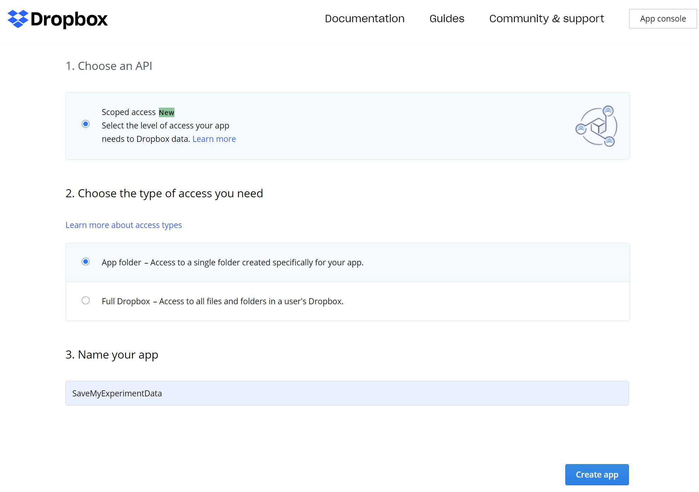
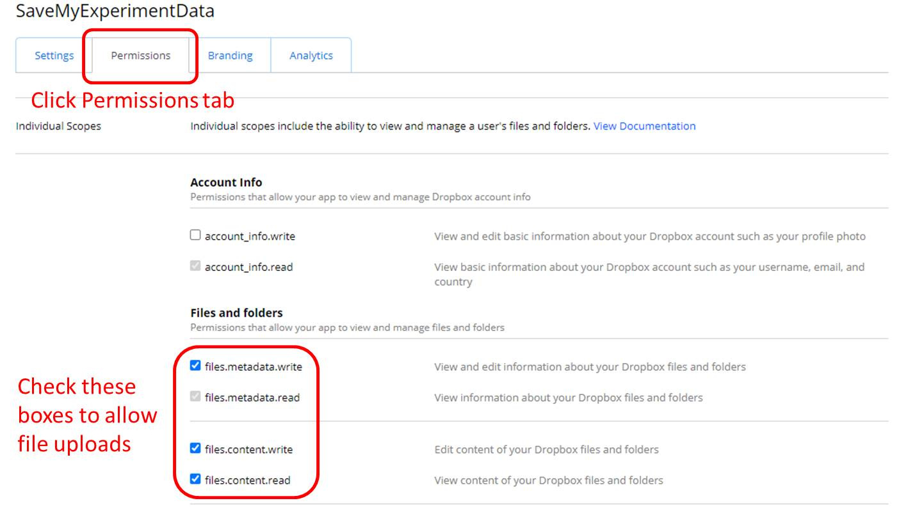
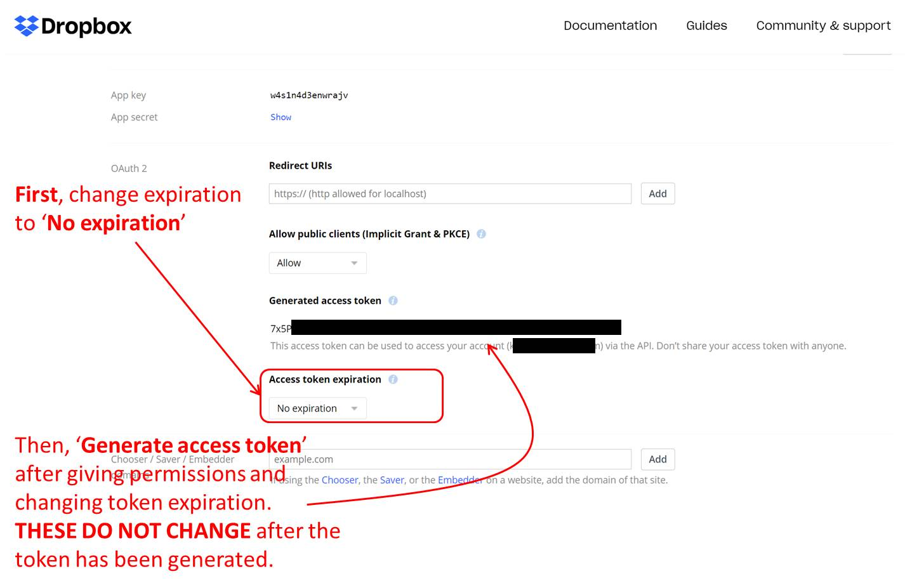
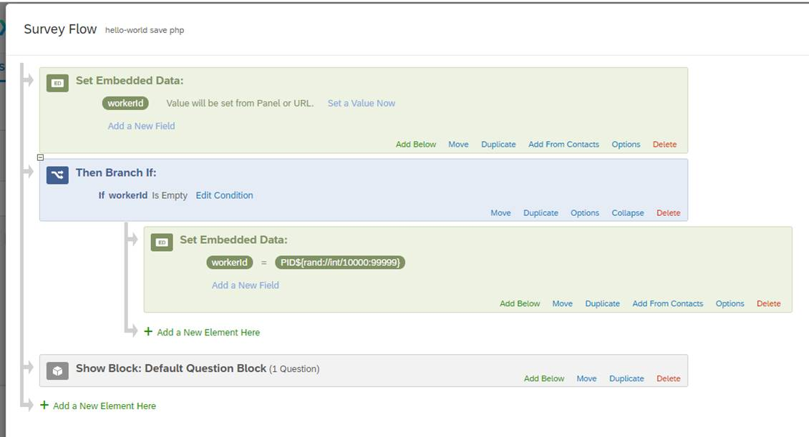
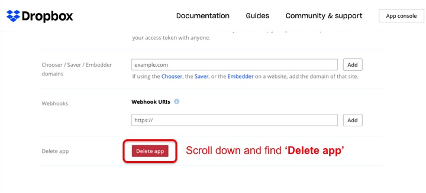

# Saving jsPsych data to your Dropbox folder

Did you know Dropbox can also act like a server for saving your files? 
You can save each participant's data file **without access to a web server!**

**<font color=red>WARNING</font>: Dropbox will retire the creation of long-lived access tokens on <font color=red>September 30th, 2021</font>. After that, this tutorial <font color=red>WILL NOT</font> work. So, please plan your experiments accordingly.** See [the Dropbox announcement](https://dropbox.tech/developers/migrating-app-permissions-and-access-tokens).

---

## Step 0. Get a Dropbox account

Go to [the Dropbox site](https://db.tt/2ppjkYTQ) and create a free account.

---

## Step 1. Create a Dropbox app for saving files

Go to [the Dropbox App console](https://www.dropbox.com/developers/apps/create) and sign in, if necessary.

Once you see a screen like below, (1) select `Scoped access`, (2) select `App folder`, and (3) name your app. 
I named my app `SaveMyExperimentData`. When you are done, click `Create app`.



---

## Step 2. Give the necessary permisions for uploading files

If your app is created successfully, you will see the tabs: `Settings`, `Permissions`, `Branding`, and `Analytics`. 

Click the **`Permissions`** tab. 

Go to `Files and folders` section and check the `files.metadata.write`, `files.content.write`, `files.content.read` boxes like below to allow file uploads.



---

## Step 3. Get the Dropbox access token

Then click the `Settings` tab, and you will see a screen like below.

1. Scroll down to find `Access token expiration` and set it to **No expiration**. If you don't change the expiration, this key will expire in 4 hours, and expiration, your experiment **CANNOT** upload files to Dropbox.
2. Then, go to `Generate access token` and click the button to get the token. If you generate the key first, then you may have to repeat the whole step because permissions and expiration cannot be changed after the token has been generated.



**<font color=red>WARNING:</font> Do NOT share this access token with anyone, 
including sharing your code, etc.
<font color=red>With this code, anyone can access or delete your Dropbox files and abuse your Dropbox account.</font>.**
So I suggest you two things when you finish your data collection. 

1. **Invalidate the access code** by deleting the app (see the [Step 8](save-dropbox.md#step-8-unlink-your-dropbox-app) below). When you delete your app, saved files in your folder remains intact. 
2. **Replace the access code with blank** in your source code, as I did in this tutorial, so that you do not accidentally publish your access code. 

---

## Step 4. Add the save function to the experiment HTML script

The Dropbox side work is done. Now, you need to add scripts to send the result file when an experiment session is done.

The `experiment-with-display-element-save-dropbox.html` file in [this GitHub repository](https://github.com/kywch/jsPsych-in-Qualtrics/blob/master/hello-world/experiment-with-display-element-save-dropbox.html) contains three additional changes from `experiment-with-display-element.html`. When you open `experiment-with-display-element-save-dropbox.html` in a browser, you should see the same "Hello world!". 

**In addtion, you will find new json and csv files in your Dropbox folder under `Apps/<your-app-name>`, 
for example, `Apps/SaveMyExperimentData`.**

We start from `experiment-with-display-element.html`, which you can see from [the Hello World! tutorial](hello-world.md#first-transformation-experiment-with-display-elementhtml). Let's look at these additional change.

### Change 4: Defining necessary variables for saving the results

You can set `task_name` and `sbj_id` as you like. However, you must provide a correct `dropbox_access_token`.

```js
// experimental session-defining variables
var task_name = "hello-world";
var sbj_id = "test01";

// YOU MUST GET YOUR OWN DROPBOX ACCESS TOKEN
var dropbox_access_token = '<PUT YOUR Dropbox ACCESS TOKEN HERE>';

// my preference is to include the task and sbj_id in the file name
var save_filename = '/' + task_name + '/' + task_name + '_' + sbj_id;
```

### Change 5. Defining save functions using Dropbox API

You must load the Dropbox API to use it.
```html
<script src="https://cdnjs.cloudflare.com/ajax/libs/dropbox.js/4.0.30/Dropbox-sdk.min.js"></script>
```

You can use either the JSON or CSV format, whichever convenient for you. The save functions look like this.

```js
/* Change 5: Defining save functions using Dropbox API */
function save_data_json() {
    try {
        var dbx = new Dropbox.Dropbox({
            fetch: fetch,
            accessToken: dropbox_access_token
        });
        dbx.filesUpload({
                path: save_filename + '.json',
                mode: 'overwrite',
                mute: true,
                contents: jsPsych.data.get().json()
            })
            .then(function (response) {
                console.log(response);
            })
            .catch(function (error) {
                console.error(error);
            });
    } catch (err) {
        console.log("Save data function failed.", err);
    }
}

function save_data_csv() {
    try {
        var dbx = new Dropbox.Dropbox({
            accessToken: dropbox_access_token
        });
        dbx.filesUpload({
                path: save_filename + '.csv',
                mode: 'overwrite',
                mute: true,
                contents: jsPsych.data.get().csv()
            })
            .then(function (response) {
                console.log(response);
            })
            .catch(function (error) {
                console.error(error);
            });
    } catch (err) {
        console.log("Save data function failed.", err);
    }        
}
```

### Change 6: Sending the results file upon completion

The `on_finish` callback can be declared in the `jsPsych.init` method. 
For details, see [the original jsPsych tutorial](https://www.jspsych.org/overview/callbacks/#on_finish-experiment).
The callback will trigger once all trials in the experiment have been run, so it is a great place to call save functions.

**NOTE: Here, both `save_data_json()` and `save_data_csv()` were called to show how these can be used. Choose one.**

```js
    jsPsych.init({
        timeline: [hello_trial],
        display_element: 'display_stage',
        
        /* Change 6: Sending the results file upon completion */
        on_finish: function() {
            save_data_json();
            save_data_csv();
        }
    })
```

### Putting it all together

So the `experiment-with-display-element-save-dropbox.html` code looks like this. This html file should save the result files to your server.

```html
<!DOCTYPE html>
<html>

<head>
    <title>My experiment</title>
    <!-- Change 5: Defining save functions using Dropbox API -->
    <script src="https://cdnjs.cloudflare.com/ajax/libs/dropbox.js/4.0.30/Dropbox-sdk.min.js"></script>
    <script src="jspsych-6.1.0/jspsych.js"></script>
    <script src="jspsych-6.1.0/plugins/jspsych-html-keyboard-response.js"></script>
    <link href="jspsych-6.1.0/css/jspsych.css" rel="stylesheet" type="text/css">
    </link>
</head>

<body>

    <!-- Change 3: Adding extra scripts for Qualtrics -->
    <!-- COPY PASTE TO QUALTRICS FROM HERE -->
    <link href="https://kywch.github.io/jsPsych/css/jspsych.css" rel="stylesheet" type="text/css">
    </link>
    <div>
        <span style="font-size: 24px;">
            <br><br>
            If you are seeing this message for <span style="color: rgb(255, 0, 0);"><b>more than 5
                    minutes</b></span>,<br>
            please screen-capture this screen and send the image to us.
            <br><br>
            <span style="font-size: 28px;">We are very sorry for the inconvenience.</span>
        </span>
    </div>

    <!-- Change 2: Adding `display_stage` CSS and Div -->
    <style>
        #display_stage_background {
            width: 100vw;
            background-color: white;
            z-index: -1;
        }

        #display_stage {
            position: fixed;
            left: 1vw;
            top: 1vh;
            height: 98vh;
            width: 98vw;
            background-color: white;
            box-shadow: 1px 1px 1px #999;
            border-radius: 15px;
            z-index: 0;
            overflow-y: hidden;
            overflow-x: hidden;
        }
    </style>
    <!-- COPY PASTE TO QUALTRICS UP TO HERE -->

    <div id='display_stage_background'></div>
    <div id='display_stage'></div>

</body>

<script>
    /* Change 4: Defining necessary variables for saving the results */
    // experimental session-defining variables
    var task_name = "hello-world";
    var sbj_id = "test01";

    // YOU MUST GET YOUR OWN DROPBOX ACCESS TOKEN
    var dropbox_access_token = '<PUT YOUR Dropbox ACCESS TOKEN HERE>';

    // my preference is to include the task and sbj_id in the file name
    var save_filename = '/' + task_name + '/' + task_name + '_' + sbj_id;

    /* Change 5: Defining save functions using Dropbox API */
    function save_data_json() {
        try {
            var dbx = new Dropbox.Dropbox({
                accessToken: dropbox_access_token
            });
            dbx.filesUpload({
                    path: save_filename + '.json',
                    mode: 'overwrite',
                    mute: true,
                    contents: jsPsych.data.get().json()
                })
                .then(function (response) {
                    console.log(response);
                })
                .catch(function (error) {
                    console.error(error);
                });
        } catch (err) {
            console.log("Save data function failed.", err);
        }
    }

    function save_data_csv() {
        try {
            var dbx = new Dropbox.Dropbox({
                accessToken: dropbox_access_token
            });
            dbx.filesUpload({
                    path: save_filename + '.csv',
                    mode: 'overwrite',
                    mute: true,
                    contents: jsPsych.data.get().csv()
                })
                .then(function (response) {
                    console.log(response);
                })
                .catch(function (error) {
                    console.error(error);
                });
        } catch (err) {
            console.log("Save data function failed.", err);
        }        
    }

    var hello_trial = {
        type: 'html-keyboard-response',
        stimulus: 'Hello world!'
    }

    /* Change 1: Using `display_element` */
    jsPsych.init({
        timeline: [hello_trial],
        display_element: 'display_stage',

        /* Change 6: Sending the results file upon completion */
        on_finish: function () {
            save_data_json();
            save_data_csv();
        }
    })
</script>

</html>
```
---

## Step 5. Add Participand ID to Qualtrics

Let's log in to Qualtrics. The basics of embedding jsPsych experiment into Qualtrics is explained in the [Embedding Hello World!](hello-world.md#finally-embedding-jspsych-in-qualtrics) page. 

However, if you want to save the experiment data elsewhere, you must have the Participant ID so that you can link Qualtrics data and the experiment file later.
In Qualtrics, you can keep or assign the participant ID using [Embedded Data elements](https://www.qualtrics.com/support/survey-platform/survey-module/survey-flow/standard-elements/embedded-data/#CreatingAnEmbeddedDataElement).

The below steps will create the Embedded Data called `workerId`, which will hold the Participant ID. The value of `workerId` can be set from the Qualtrics survey URL (for details, see [Qualtrics.com: Setting values from the Survey URL](https://www.qualtrics.com/support/survey-platform/survey-module/survey-flow/standard-elements/embedded-data/#SettingValuesFromTheSurveyURL) and [Qualtrics.com: Passing information through query string](https://www.qualtrics.com/support/survey-platform/survey-module/survey-flow/standard-elements/passing-information-through-query-strings/)). However, if `workerId` is not set, then Qualtrics will automatically generate a random Participant ID, ranging from PID10000 - PID99999, and use this ID to save data.

Setting the name of participant ID variable depends on how you recruit your participants (see the [Recruiting Participants](participants.md) section). I set its name to be `workerId` because I have been using [Cloudresearch/TurkPrime](https://www.cloudresearch.com/) with Amazon MTurk, 
and [Cloudresearch uses `workerId` to automatically add Mturk Worker ID](https://www.cloudresearch.com/resources/blog/workerid-and-all-mturk-fields-sent-to-qualtrics/). 
However, other services suggest different field name -- for example, [Prolific suggests `PROLIFIC_PID`](https://researcher-help.prolific.co/hc/en-gb/articles/360009220993-Recording-participants-Prolific-IDs-in-your-study-survey) -- so please follow the Qualtrics integration guide from the participant recruiting service you are using.

1. Click **Survey Flow** from the Survey tab
2. Click **Add a New Element Here**
3. Choose **Embedded Data** 
4. Click **Create New Field or Choose From Dropdown** and type **workerId**. *<font color=red>WARNING: These fields are case sensitive. The I in Id is capitalized. All other letters are lower case.</font>*
5. Click **Add Below** on this Set Embedded Data block
6. Choose **Branch**
7. Click **Add a Condition**
8. Click **Question** --> choose **Embedded Data**
9. Type in **workerId**
10. Click **Is Equal to** --> choose **Is Empty**
11. Click **Add a New Element Here** under the Branch block
12. Choose **Embedded Data**
13. Click **Create New Field or Choose From Dropdown** and type **workerId**.
14. CLick **Set a Value Now**
15. Type in **PID${rand://int/10000:99999}** --> This generates a random Participant ID between PID10000 and PID99999. For details, see [Qualtrics.com: Assigning Randomized IDs to Respondents](https://www.qualtrics.com/support/survey-platform/common-use-cases-rc/assigning-randomized-ids-to-respondents/).
16. Click **Move** of the new blocks you created (`Set Embedded Data` and `Then Branch If`) and move these blocks the top of Survey Flow

After these steps, you should see a screen like below.



---

## Step 6. Use the save function from Qualtrics

The `qualtrics-save-dropbox.js` file in [this GitHub repository](https://github.com/kywch/jsPsych-in-Qualtrics/blob/master/hello-world/qualtrics-save-php.js) contains additional changes from `qualtrics.js` and `experiment-with-display-element-save-dropbox.html` and can be direclty copy-pasted into the Qualtrics Question JavaScript Editor.

We start from `qualtrics.js`, which you can see from [the Hello World! tutorial](hello-world.md#second-transformation-qualtricsjs). 
Let's look at these additional change.

### Change 6: Loading the Dropbox API

Add the Dropbox API library `https://cdnjs.cloudflare.com/ajax/libs/dropbox.js/4.0.30/Dropbox-sdk.min.js`
to `requiredResources` like below so that Qualtrics loads the Dropbox API.

```js
var requiredResources = [
    'https://cdnjs.cloudflare.com/ajax/libs/dropbox.js/4.0.30/Dropbox-sdk.min.js', // Change 6: Loading the Dropbox API
    jslib_url + "jspsych.js",
    jslib_url + "plugins/jspsych-html-keyboard-response.js"
];
```

### Change 7: Adding necessary variables and functions for saving the results

The below javascript defines necessary variables and functions for saving the results.
Importantly, this script will grab the Participant ID from the Embedded Data `workerId`, using the piped text `${e://Field/workerId}`, 
and put it in the data file name.

**IMPORTANT: You must also provide a correct `dropbox_access_token`.** 

```js
// experimental session-defining variables
var task_name = "hello-world";
var sbj_id = "${e://Field/workerId}";

// YOU MUST GET YOUR OWN DROPBOX ACCESS TOKEN
var dropbox_access_token = '<PUT YOUR Dropbox ACCESS TOKEN HERE>';

// my preference is to include the task and sbj_id in the file name
var save_filename = '/' + task_name + '/' + task_name + '_' + sbj_id;

function save_data_json() {
    try {
        var dbx = new Dropbox.Dropbox({
            accessToken: dropbox_access_token
        });
        dbx.filesUpload({
                path: save_filename + '.json',
                mode: 'overwrite',
                mute: true,
                contents: jsPsych.data.get().json()
            })
            .then(function (response) {
                console.log(response);
            })
            .catch(function (error) {
                console.error(error);
            });
    } catch (err) {
        console.log("Save data function failed.", err);
    }
}

function save_data_csv() {
    try {
        var dbx = new Dropbox.Dropbox({
            accessToken: dropbox_access_token
        });
        dbx.filesUpload({
                path: save_filename + '.csv',
                mode: 'overwrite',
                mute: true,
                contents: jsPsych.data.get().csv()
            })
            .then(function (response) {
                console.log(response);
            })
            .catch(function (error) {
                console.error(error);
            });
    } catch (err) {
        console.log("Save data function failed.", err);
    }        
}
```

### Change 8: Calling the save function -- CHOOSE ONE!

The save function was added inside `on_finish`, which is called once all trials in the experiment have been run.

The participant ID, `sbj_id`, was added to the data itself, so that you can match the data file even when the file name is changed.

**NOTE: Here, both `save_data_json()` and `save_data_csv()` were called to show how these can be used. Choose one.**

```js
jsPsych.init({
    timeline: [hello_trial],
    display_element: 'display_stage',

    /* Change 5: Adding the clean up and continue functions.*/
    on_finish: function (data) {

        /* Change 8: Calling the save function -- CHOOSE ONE! */
        // include the participant ID in the data
        // this must be done before saving
        jsPsych.data.get().addToLast({participant: sbj_id});        
        save_data_json();
        save_data_csv();

        // clear the stage
        jQuery('display_stage').remove();
        jQuery('display_stage_background').remove();

        // simulate click on Qualtrics "next" button, making use of the Qualtrics JS API
        qthis.clickNextButton();
    }
});
```

### Putting it all together

So the `qualtrics-save-dropbox.js` code looks like this. Embed this script in Qualtrics by following [these steps](hello-world.md#finally-embedding-jspsych-in-qualtrics) and see whether your save function works.

```js
Qualtrics.SurveyEngine.addOnload(function () {

    /*Place your JavaScript here to run when the page loads*/

    /* Change 1: Hiding the Next button */
    // Retrieve Qualtrics object and save in qthis
    var qthis = this;

    // Hide buttons
    qthis.hideNextButton();

    /* Change 2: Defining and loading required resources */
    var jslib_url = "https://kywch.github.io/jsPsych/";

    // the below urls must be accessible with your browser
    // for example, https://kywch.github.io/jsPsych/jspsych.js
    var requiredResources = [
        'https://cdnjs.cloudflare.com/ajax/libs/dropbox.js/4.0.30/Dropbox-sdk.min.js', // Change 6: Loading the Dropbox API
        jslib_url + "jspsych.js",
        jslib_url + "plugins/jspsych-html-keyboard-response.js"
    ];

    function loadScript(idx) {
        console.log("Loading ", requiredResources[idx]);
        jQuery.getScript(requiredResources[idx], function () {
            if ((idx + 1) < requiredResources.length) {
                loadScript(idx + 1);
            } else {
                initExp();
            }
        });
    }

    if (window.Qualtrics && (!window.frameElement || window.frameElement.id !== "mobile-preview-view")) {
        loadScript(0);
    }

    /* Change 3: Appending the display_stage Div using jQuery */
    // jQuery is loaded in Qualtrics by default
    jQuery("<div id = 'display_stage_background'></div>").appendTo('body');
    jQuery("<div id = 'display_stage'></div>").appendTo('body');

    /* Change 7: Adding necessary variables and functions for saving the results */
    // experimental session-defining variables
    var task_name = "hello-world";
    var sbj_id = "${e://Field/workerId}";

    // YOU MUST GET YOUR OWN DROPBOX ACCESS TOKEN
    var dropbox_access_token = '<PUT YOUR Dropbox ACCESS TOKEN HERE>';

    // my preference is to include the task and sbj_id in the file name
    var save_filename = '/' + task_name + '/' + task_name + '_' + sbj_id;

    function save_data_json() {
        try {
            var dbx = new Dropbox.Dropbox({
                accessToken: dropbox_access_token
            });
            dbx.filesUpload({
                    path: save_filename + '.json',
                    mode: 'overwrite',
                    mute: true,
                    contents: jsPsych.data.get().json()
                })
                .then(function (response) {
                    console.log(response);
                })
                .catch(function (error) {
                    console.error(error);
                });
        } catch (err) {
            console.log("Save data function failed.", err);
        }
    }

    function save_data_csv() {
        try {
            var dbx = new Dropbox.Dropbox({
                accessToken: dropbox_access_token
            });
            dbx.filesUpload({
                    path: save_filename + '.csv',
                    mode: 'overwrite',
                    mute: true,
                    contents: jsPsych.data.get().csv()
                })
                .then(function (response) {
                    console.log(response);
                })
                .catch(function (error) {
                    console.error(error);
                });
        } catch (err) {
            console.log("Save data function failed.", err);
        }        
    }

    /* Change 4: Wraping jsPsych.init() in a function */
    function initExp() {

        var hello_trial = {
            type: 'html-keyboard-response',
            stimulus: 'Hello world!'
        }

        jsPsych.init({
            timeline: [hello_trial],
            display_element: 'display_stage',

            /* Change 5: Adding the clean up and continue functions.*/
            on_finish: function (data) {

                /* Change 8: Calling the save function -- CHOOSE ONE! */
                // include the participant ID in the data
                // this must be done before saving
                jsPsych.data.get().addToLast({participant: sbj_id});

                save_data_json();
                save_data_csv();

                // clear the stage
                jQuery('display_stage').remove();
                jQuery('display_stage_background').remove();

                // simulate click on Qualtrics "next" button, making use of the Qualtrics JS API
                qthis.clickNextButton();
            }
        });
    }
});

Qualtrics.SurveyEngine.addOnReady(function () {
    /*Place your JavaScript here to run when the page is fully displayed*/

});

Qualtrics.SurveyEngine.addOnUnload(function () {
    /*Place your JavaScript here to run when the page is unloaded*/

});
```

---

## Step 7. Download the data? You already have them!

When an experimental session finishes, its file will instantly delivered to your Dropbox folder. 

Isn't it nice?

---

## Step 8. Unlink your Dropbox app

As I mentioned in the [Step 2](#step-2-get-the-dropbox-access-token), 
the Dropbox access token you have is dangerous because anyone with the code can
access or delete your Dropbox files and abuse your Dropbox account.

So it is safe to delete the app after your data collection is done.
However, **the saved files in your Dropbox folder remains intact,** so you don't need to worry.

Deleting the app is very simple. Go to [the Dropbox App console](https://www.dropbox.com/developers/apps/), 
click your app, scroll down, and click the `Delete app` button.



After this step, your Dropbox is safe.